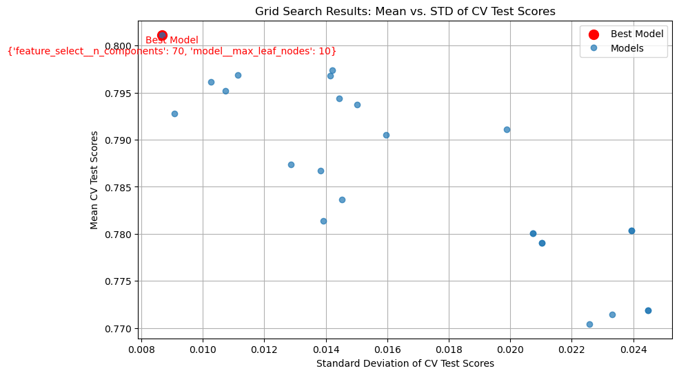

## Machine Learning Practice

Objectives:
1. Preprocesses realistic data (multiple variable types) in a pipeline that handles each variable type
1. Estimates a model using CV
1. Hypertunes a model on a CV folds within training sample
1. Finally, evaluate its performance in the test sample

Let's start by loading the data


```python
import pandas as pd
import numpy as np
from sklearn.model_selection import train_test_split

# load data and split off X and y
housing = pd.read_csv('input_data2/housing_train.csv')
y = np.log(housing.v_SalePrice)
housing = housing.drop('v_SalePrice',axis=1)
```


Per the recommendations in the [sk-learn documentation](https://scikit-learn.org/stable/common_pitfalls.html#general-recommendations), what that means is we need to put `random_state=rng` inside every function in this file that accepts "random_state" as an argument.


```python
# create test set for use later - notice the (random_state=rng)
rng = np.random.RandomState(0)
X_train, X_test, y_train, y_test = train_test_split(housing, y, random_state=rng)
```

## Part 1: Preprocessing the data

```python
from sklearn.compose import make_column_transformer, make_column_selector
from sklearn.pipeline import make_pipeline
from sklearn.impute import SimpleImputer
from sklearn.preprocessing import StandardScaler, OneHotEncoder

# Define pipelines for numerical and categorical data
numer_pipe = make_pipeline(
    SimpleImputer(strategy="mean"),
    StandardScaler())
cat_pipe = make_pipeline(
    OneHotEncoder(handle_unknown="ignore"))
# Combine the pipelines into a single preprocessing pipeline
preproc_pipe = make_column_transformer(
    (numer_pipe, make_column_selector(dtype_include=["int64", "float64"])),
    (cat_pipe, ["v_Lot_Config"]),
    remainder="drop"  # Drop all other variables
)
# Fit the pipeline and transform X_train
preproc_pipe.fit(X_train)

# Get feature names from the pipeline
numerical_features = preproc_pipe.named_transformers_['pipeline-1'].get_feature_names_out()
categorical_features = preproc_pipe.named_transformers_['pipeline-2'].get_feature_names_out(["v_Lot_Config"])
all_features = list(numerical_features) + list(categorical_features)

# Transform the data and create a DataFrame with proper column names
X_train_preprocessed = preproc_pipe.transform(X_train)
X_train_preprocessed_df = pd.DataFrame(
    X_train_preprocessed.toarray() if hasattr(X_train_preprocessed, "toarray") else X_train_preprocessed,
    columns=all_features
)
# Output the number of columns
print(f"Number of columns in preprocessed data: {X_train_preprocessed_df.shape[1]}")
X_train_preprocessed_df.describe().round(2)

```

    Number of columns in preprocessed data: 41
    


<div>
<style scoped>
    .dataframe tbody tr th:only-of-type {
        vertical-align: middle;
    }

    .dataframe tbody tr th {
        vertical-align: top;
    }

    .dataframe thead th {
        text-align: right;
    }
</style>
<table border="1" class="dataframe">
  <thead>
    <tr style="text-align: right;">
      <th></th>
      <th>v_MS_SubClass</th>
      <th>v_Lot_Frontage</th>
      <th>v_Lot_Area</th>
      <th>v_Overall_Qual</th>
      <th>v_Overall_Cond</th>
      <th>v_Year_Built</th>
      <th>v_Year_Remod/Add</th>
      <th>v_Mas_Vnr_Area</th>
      <th>v_BsmtFin_SF_1</th>
      <th>v_BsmtFin_SF_2</th>
      <th>...</th>
      <th>v_Screen_Porch</th>
      <th>v_Pool_Area</th>
      <th>v_Misc_Val</th>
      <th>v_Mo_Sold</th>
      <th>v_Yr_Sold</th>
      <th>v_Lot_Config_Corner</th>
      <th>v_Lot_Config_CulDSac</th>
      <th>v_Lot_Config_FR2</th>
      <th>v_Lot_Config_FR3</th>
      <th>v_Lot_Config_Inside</th>
    </tr>
  </thead>
  <tbody>
    <tr>
      <th>count</th>
      <td>1455.00</td>
      <td>1455.00</td>
      <td>1455.00</td>
      <td>1455.00</td>
      <td>1455.00</td>
      <td>1455.00</td>
      <td>1455.00</td>
      <td>1455.00</td>
      <td>1455.00</td>
      <td>1455.00</td>
      <td>...</td>
      <td>1455.00</td>
      <td>1455.00</td>
      <td>1455.00</td>
      <td>1455.00</td>
      <td>1455.00</td>
      <td>1455.00</td>
      <td>1455.00</td>
      <td>1455.00</td>
      <td>1455.00</td>
      <td>1455.00</td>
    </tr>
    <tr>
      <th>mean</th>
      <td>0.00</td>
      <td>0.00</td>
      <td>0.00</td>
      <td>0.00</td>
      <td>0.00</td>
      <td>-0.00</td>
      <td>0.00</td>
      <td>0.00</td>
      <td>0.00</td>
      <td>0.00</td>
      <td>...</td>
      <td>-0.00</td>
      <td>-0.00</td>
      <td>-0.00</td>
      <td>-0.00</td>
      <td>-0.00</td>
      <td>0.18</td>
      <td>0.06</td>
      <td>0.02</td>
      <td>0.01</td>
      <td>0.73</td>
    </tr>
    <tr>
      <th>std</th>
      <td>1.00</td>
      <td>1.00</td>
      <td>1.00</td>
      <td>1.00</td>
      <td>1.00</td>
      <td>1.00</td>
      <td>1.00</td>
      <td>1.00</td>
      <td>1.00</td>
      <td>1.00</td>
      <td>...</td>
      <td>1.00</td>
      <td>1.00</td>
      <td>1.00</td>
      <td>1.00</td>
      <td>1.00</td>
      <td>0.38</td>
      <td>0.24</td>
      <td>0.15</td>
      <td>0.08</td>
      <td>0.44</td>
    </tr>
    <tr>
      <th>min</th>
      <td>-0.89</td>
      <td>-2.20</td>
      <td>-1.17</td>
      <td>-3.70</td>
      <td>-4.30</td>
      <td>-3.08</td>
      <td>-1.63</td>
      <td>-0.57</td>
      <td>-0.96</td>
      <td>-0.29</td>
      <td>...</td>
      <td>-0.29</td>
      <td>-0.08</td>
      <td>-0.09</td>
      <td>-2.03</td>
      <td>-1.24</td>
      <td>0.00</td>
      <td>0.00</td>
      <td>0.00</td>
      <td>0.00</td>
      <td>0.00</td>
    </tr>
    <tr>
      <th>25%</th>
      <td>-0.89</td>
      <td>-0.43</td>
      <td>-0.39</td>
      <td>-0.81</td>
      <td>-0.53</td>
      <td>-0.62</td>
      <td>-0.91</td>
      <td>-0.57</td>
      <td>-0.96</td>
      <td>-0.29</td>
      <td>...</td>
      <td>-0.29</td>
      <td>-0.08</td>
      <td>-0.09</td>
      <td>-0.55</td>
      <td>-1.24</td>
      <td>0.00</td>
      <td>0.00</td>
      <td>0.00</td>
      <td>0.00</td>
      <td>0.00</td>
    </tr>
    <tr>
      <th>50%</th>
      <td>-0.20</td>
      <td>0.00</td>
      <td>-0.11</td>
      <td>-0.09</td>
      <td>-0.53</td>
      <td>0.05</td>
      <td>0.43</td>
      <td>-0.57</td>
      <td>-0.16</td>
      <td>-0.29</td>
      <td>...</td>
      <td>-0.29</td>
      <td>-0.08</td>
      <td>-0.09</td>
      <td>-0.18</td>
      <td>0.00</td>
      <td>0.00</td>
      <td>0.00</td>
      <td>0.00</td>
      <td>0.00</td>
      <td>1.00</td>
    </tr>
    <tr>
      <th>75%</th>
      <td>0.26</td>
      <td>0.39</td>
      <td>0.19</td>
      <td>0.64</td>
      <td>0.41</td>
      <td>0.98</td>
      <td>0.96</td>
      <td>0.33</td>
      <td>0.65</td>
      <td>-0.29</td>
      <td>...</td>
      <td>-0.29</td>
      <td>-0.08</td>
      <td>-0.09</td>
      <td>0.56</td>
      <td>1.25</td>
      <td>0.00</td>
      <td>0.00</td>
      <td>0.00</td>
      <td>0.00</td>
      <td>1.00</td>
    </tr>
    <tr>
      <th>max</th>
      <td>3.03</td>
      <td>11.07</td>
      <td>20.68</td>
      <td>2.80</td>
      <td>3.24</td>
      <td>1.22</td>
      <td>1.20</td>
      <td>7.87</td>
      <td>11.20</td>
      <td>8.29</td>
      <td>...</td>
      <td>9.69</td>
      <td>17.05</td>
      <td>24.19</td>
      <td>2.04</td>
      <td>1.25</td>
      <td>1.00</td>
      <td>1.00</td>
      <td>1.00</td>
      <td>1.00</td>
      <td>1.00</td>
    </tr>
  </tbody>
</table>
<p>8 rows × 41 columns</p>
</div>


## Part 2: Estimating one model

```python
from sklearn.linear_model import LassoCV
from sklearn.pipeline import Pipeline
from sklearn.model_selection import cross_val_score, KFold
# Define the LassoCV model
lasso_cv_model = LassoCV(cv=10, random_state=rng)
# Create a pipeline combining the preprocessor and the LassoCV model
model_pipeline = Pipeline([
    ('preprocessor', preproc_pipe), ('lasso_cv', lasso_cv_model)
])
# Perform 10-fold cross-validation with R^2 scoring
cv = KFold(n_splits=10, shuffle=True, random_state=rng)
cv_scores = cross_val_score(model_pipeline, X_train, y_train, cv=cv, scoring='r2')
mean_score = cv_scores.mean()
print(f"1. Mean Score: {mean_score:.5f}")
```

    1. Mean Score: 0.83437
    


```python
#b
lasso_cv_model = LassoCV(cv=10, random_state=rng)
# Fit the pipeline to the training data
model_pipeline.fit(X_train, y_train)

optimal_alpha = model_pipeline.named_steps['lasso_cv'].alpha_
print(f"2.1) Optimal alpha: {optimal_alpha:.5f}")
r2_score_train = model_pipeline.score(X_train, y_train)
print(f"2.2) R^2 score on test set: {r2_score_train:.5f}")
coefficients = model_pipeline.named_steps['lasso_cv'].coef_
nonZeroNumber = (coefficients != 0).sum()
print(f"2.3) # of Variables Selected: {nonZeroNumber}")

coefficients = model_pipeline.named_steps['lasso_cv'].coef_
feature_names = all_features  
coef_df = pd.DataFrame({
    'Feature': feature_names, 'Coefficient': coefficients
})
non_zero = coef_df[coef_df['Coefficient'] != 0]
top5 = non_zero.nlargest(5, 'Coefficient')
print(f"2.4) Top 5 non-zero coefficients:")
print(top5)
bot5 = non_zero.nsmallest(5, 'Coefficient')
print(f"2.5) Bottotm 5 non-zero coefficients:")
print(bot5)
r2_score_test = model_pipeline.score(X_test, y_test)
print(f"2.6) R^2 score on test set: {r2_score_test:.5f}")
```

    2.1) Optimal alpha: 0.00802
    2.2) R^2 score on test set: 0.86264
    2.3) # of Variables Selected: 21
    2.4) Top 5 non-zero coefficients:
               Feature  Coefficient
    3   v_Overall_Qual     0.134599
    15   v_Gr_Liv_Area     0.098313
    5     v_Year_Built     0.065831
    25   v_Garage_Cars     0.047635
    4   v_Overall_Cond     0.035216
    2.5) Bottotm 5 non-zero coefficients:
                Feature  Coefficient
    0     v_MS_SubClass    -0.020093
    33       v_Misc_Val    -0.017537
    21  v_Kitchen_AbvGr    -0.003737
    32      v_Pool_Area    -0.002016
    20  v_Bedroom_AbvGr     0.003556
    2.6) R^2 score on test set: 0.86503
    

## Part 3: Optimizing and estimating your own model

```python
#1. 
from sklearn.preprocessing import PolynomialFeatures
from sklearn.decomposition import PCA
from sklearn.ensemble import HistGradientBoostingRegressor

# Preprocessing
numer_pipe = Pipeline([
    ('imputer', SimpleImputer(strategy='mean')), ('scaler', StandardScaler()),
    ('poly', PolynomialFeatures(degree=2, include_bias=False))  
])
cat_pipe = Pipeline([('imputer', SimpleImputer(strategy='most_frequent')), ('onehot', OneHotEncoder(handle_unknown='ignore'))])
preproc_pipe = make_column_transformer(
    (numer_pipe, make_column_selector(dtype_include=['int64', 'float64'])),
    (cat_pipe, make_column_selector(dtype_include=['object'])),
    remainder='drop'
)
#Full Pipeline
pipeline = Pipeline([
    ("preprocessor", preproc_pipe),
    ("feature_select", PCA(n_components=20, random_state=rng)),
    ("model", HistGradientBoostingRegressor(random_state=rng))
])
print("Output 1")
pipeline

```

    Output 1
    


<style>#sk-container-id-1 {
  /* Definition of color scheme common for light and dark mode */
  --sklearn-color-text: black;
  --sklearn-color-line: gray;
  /* Definition of color scheme for unfitted estimators */
  --sklearn-color-unfitted-level-0: #fff5e6;
  --sklearn-color-unfitted-level-1: #f6e4d2;
  --sklearn-color-unfitted-level-2: #ffe0b3;
  --sklearn-color-unfitted-level-3: chocolate;
  /* Definition of color scheme for fitted estimators */
  --sklearn-color-fitted-level-0: #f0f8ff;
  --sklearn-color-fitted-level-1: #d4ebff;
  --sklearn-color-fitted-level-2: #b3dbfd;
  --sklearn-color-fitted-level-3: cornflowerblue;

  /* Specific color for light theme */
  --sklearn-color-text-on-default-background: var(--sg-text-color, var(--theme-code-foreground, var(--jp-content-font-color1, black)));
  --sklearn-color-background: var(--sg-background-color, var(--theme-background, var(--jp-layout-color0, white)));
  --sklearn-color-border-box: var(--sg-text-color, var(--theme-code-foreground, var(--jp-content-font-color1, black)));
  --sklearn-color-icon: #696969;

  @media (prefers-color-scheme: dark) {
    /* Redefinition of color scheme for dark theme */
    --sklearn-color-text-on-default-background: var(--sg-text-color, var(--theme-code-foreground, var(--jp-content-font-color1, white)));
    --sklearn-color-background: var(--sg-background-color, var(--theme-background, var(--jp-layout-color0, #111)));
    --sklearn-color-border-box: var(--sg-text-color, var(--theme-code-foreground, var(--jp-content-font-color1, white)));
    --sklearn-color-icon: #878787;
  }
}

#sk-container-id-1 {
  color: var(--sklearn-color-text);
}

#sk-container-id-1 pre {
  padding: 0;
}

#sk-container-id-1 input.sk-hidden--visually {
  border: 0;
  clip: rect(1px 1px 1px 1px);
  clip: rect(1px, 1px, 1px, 1px);
  height: 1px;
  margin: -1px;
  overflow: hidden;
  padding: 0;
  position: absolute;
  width: 1px;
}

#sk-container-id-1 div.sk-dashed-wrapped {
  border: 1px dashed var(--sklearn-color-line);
  margin: 0 0.4em 0.5em 0.4em;
  box-sizing: border-box;
  padding-bottom: 0.4em;
  background-color: var(--sklearn-color-background);
}

#sk-container-id-1 div.sk-container {
  /* jupyter's `normalize.less` sets `[hidden] { display: none; }`
     but bootstrap.min.css set `[hidden] { display: none !important; }`
     so we also need the `!important` here to be able to override the
     default hidden behavior on the sphinx rendered scikit-learn.org.
     See: https://github.com/scikit-learn/scikit-learn/issues/21755 */
  display: inline-block !important;
  position: relative;
}

#sk-container-id-1 div.sk-text-repr-fallback {
  display: none;
}

div.sk-parallel-item,
div.sk-serial,
div.sk-item {
  /* draw centered vertical line to link estimators */
  background-image: linear-gradient(var(--sklearn-color-text-on-default-background), var(--sklearn-color-text-on-default-background));
  background-size: 2px 100%;
  background-repeat: no-repeat;
  background-position: center center;
}

/* Parallel-specific style estimator block */

#sk-container-id-1 div.sk-parallel-item::after {
  content: "";
  width: 100%;
  border-bottom: 2px solid var(--sklearn-color-text-on-default-background);
  flex-grow: 1;
}

#sk-container-id-1 div.sk-parallel {
  display: flex;
  align-items: stretch;
  justify-content: center;
  background-color: var(--sklearn-color-background);
  position: relative;
}

#sk-container-id-1 div.sk-parallel-item {
  display: flex;
  flex-direction: column;
}

#sk-container-id-1 div.sk-parallel-item:first-child::after {
  align-self: flex-end;
  width: 50%;
}

#sk-container-id-1 div.sk-parallel-item:last-child::after {
  align-self: flex-start;
  width: 50%;
}

#sk-container-id-1 div.sk-parallel-item:only-child::after {
  width: 0;
}

/* Serial-specific style estimator block */

#sk-container-id-1 div.sk-serial {
  display: flex;
  flex-direction: column;
  align-items: center;
  background-color: var(--sklearn-color-background);
  padding-right: 1em;
  padding-left: 1em;
}


/* Toggleable style: style used for estimator/Pipeline/ColumnTransformer box that is
clickable and can be expanded/collapsed.
- Pipeline and ColumnTransformer use this feature and define the default style
- Estimators will overwrite some part of the style using the `sk-estimator` class
*/

/* Pipeline and ColumnTransformer style (default) */

#sk-container-id-1 div.sk-toggleable {
  /* Default theme specific background. It is overwritten whether we have a
  specific estimator or a Pipeline/ColumnTransformer */
  background-color: var(--sklearn-color-background);
}

/* Toggleable label */
#sk-container-id-1 label.sk-toggleable__label {
  cursor: pointer;
  display: block;
  width: 100%;
  margin-bottom: 0;
  padding: 0.5em;
  box-sizing: border-box;
  text-align: center;
}

#sk-container-id-1 label.sk-toggleable__label-arrow:before {
  /* Arrow on the left of the label */
  content: "▸";
  float: left;
  margin-right: 0.25em;
  color: var(--sklearn-color-icon);
}

#sk-container-id-1 label.sk-toggleable__label-arrow:hover:before {
  color: var(--sklearn-color-text);
}

/* Toggleable content - dropdown */

#sk-container-id-1 div.sk-toggleable__content {
  max-height: 0;
  max-width: 0;
  overflow: hidden;
  text-align: left;
  /* unfitted */
  background-color: var(--sklearn-color-unfitted-level-0);
}

#sk-container-id-1 div.sk-toggleable__content.fitted {
  /* fitted */
  background-color: var(--sklearn-color-fitted-level-0);
}

#sk-container-id-1 div.sk-toggleable__content pre {
  margin: 0.2em;
  border-radius: 0.25em;
  color: var(--sklearn-color-text);
  /* unfitted */
  background-color: var(--sklearn-color-unfitted-level-0);
}

#sk-container-id-1 div.sk-toggleable__content.fitted pre {
  /* unfitted */
  background-color: var(--sklearn-color-fitted-level-0);
}

#sk-container-id-1 input.sk-toggleable__control:checked~div.sk-toggleable__content {
  /* Expand drop-down */
  max-height: 200px;
  max-width: 100%;
  overflow: auto;
}

#sk-container-id-1 input.sk-toggleable__control:checked~label.sk-toggleable__label-arrow:before {
  content: "▾";
}

/* Pipeline/ColumnTransformer-specific style */

#sk-container-id-1 div.sk-label input.sk-toggleable__control:checked~label.sk-toggleable__label {
  color: var(--sklearn-color-text);
  background-color: var(--sklearn-color-unfitted-level-2);
}

#sk-container-id-1 div.sk-label.fitted input.sk-toggleable__control:checked~label.sk-toggleable__label {
  background-color: var(--sklearn-color-fitted-level-2);
}

/* Estimator-specific style */

/* Colorize estimator box */
#sk-container-id-1 div.sk-estimator input.sk-toggleable__control:checked~label.sk-toggleable__label {
  /* unfitted */
  background-color: var(--sklearn-color-unfitted-level-2);
}

#sk-container-id-1 div.sk-estimator.fitted input.sk-toggleable__control:checked~label.sk-toggleable__label {
  /* fitted */
  background-color: var(--sklearn-color-fitted-level-2);
}

#sk-container-id-1 div.sk-label label.sk-toggleable__label,
#sk-container-id-1 div.sk-label label {
  /* The background is the default theme color */
  color: var(--sklearn-color-text-on-default-background);
}

/* On hover, darken the color of the background */
#sk-container-id-1 div.sk-label:hover label.sk-toggleable__label {
  color: var(--sklearn-color-text);
  background-color: var(--sklearn-color-unfitted-level-2);
}

/* Label box, darken color on hover, fitted */
#sk-container-id-1 div.sk-label.fitted:hover label.sk-toggleable__label.fitted {
  color: var(--sklearn-color-text);
  background-color: var(--sklearn-color-fitted-level-2);
}

/* Estimator label */

#sk-container-id-1 div.sk-label label {
  font-family: monospace;
  font-weight: bold;
  display: inline-block;
  line-height: 1.2em;
}

#sk-container-id-1 div.sk-label-container {
  text-align: center;
}

/* Estimator-specific */
#sk-container-id-1 div.sk-estimator {
  font-family: monospace;
  border: 1px dotted var(--sklearn-color-border-box);
  border-radius: 0.25em;
  box-sizing: border-box;
  margin-bottom: 0.5em;
  /* unfitted */
  background-color: var(--sklearn-color-unfitted-level-0);
}

#sk-container-id-1 div.sk-estimator.fitted {
  /* fitted */
  background-color: var(--sklearn-color-fitted-level-0);
}

/* on hover */
#sk-container-id-1 div.sk-estimator:hover {
  /* unfitted */
  background-color: var(--sklearn-color-unfitted-level-2);
}

#sk-container-id-1 div.sk-estimator.fitted:hover {
  /* fitted */
  background-color: var(--sklearn-color-fitted-level-2);
}

/* Specification for estimator info (e.g. "i" and "?") */

/* Common style for "i" and "?" */

.sk-estimator-doc-link,
a:link.sk-estimator-doc-link,
a:visited.sk-estimator-doc-link {
  float: right;
  font-size: smaller;
  line-height: 1em;
  font-family: monospace;
  background-color: var(--sklearn-color-background);
  border-radius: 1em;
  height: 1em;
  width: 1em;
  text-decoration: none !important;
  margin-left: 1ex;
  /* unfitted */
  border: var(--sklearn-color-unfitted-level-1) 1pt solid;
  color: var(--sklearn-color-unfitted-level-1);
}

.sk-estimator-doc-link.fitted,
a:link.sk-estimator-doc-link.fitted,
a:visited.sk-estimator-doc-link.fitted {
  /* fitted */
  border: var(--sklearn-color-fitted-level-1) 1pt solid;
  color: var(--sklearn-color-fitted-level-1);
}

/* On hover */
div.sk-estimator:hover .sk-estimator-doc-link:hover,
.sk-estimator-doc-link:hover,
div.sk-label-container:hover .sk-estimator-doc-link:hover,
.sk-estimator-doc-link:hover {
  /* unfitted */
  background-color: var(--sklearn-color-unfitted-level-3);
  color: var(--sklearn-color-background);
  text-decoration: none;
}

div.sk-estimator.fitted:hover .sk-estimator-doc-link.fitted:hover,
.sk-estimator-doc-link.fitted:hover,
div.sk-label-container:hover .sk-estimator-doc-link.fitted:hover,
.sk-estimator-doc-link.fitted:hover {
  /* fitted */
  background-color: var(--sklearn-color-fitted-level-3);
  color: var(--sklearn-color-background);
  text-decoration: none;
}

/* Span, style for the box shown on hovering the info icon */
.sk-estimator-doc-link span {
  display: none;
  z-index: 9999;
  position: relative;
  font-weight: normal;
  right: .2ex;
  padding: .5ex;
  margin: .5ex;
  width: min-content;
  min-width: 20ex;
  max-width: 50ex;
  color: var(--sklearn-color-text);
  box-shadow: 2pt 2pt 4pt #999;
  /* unfitted */
  background: var(--sklearn-color-unfitted-level-0);
  border: .5pt solid var(--sklearn-color-unfitted-level-3);
}

.sk-estimator-doc-link.fitted span {
  /* fitted */
  background: var(--sklearn-color-fitted-level-0);
  border: var(--sklearn-color-fitted-level-3);
}

.sk-estimator-doc-link:hover span {
  display: block;
}

/* "?"-specific style due to the `<a>` HTML tag */

#sk-container-id-1 a.estimator_doc_link {
  float: right;
  font-size: 1rem;
  line-height: 1em;
  font-family: monospace;
  background-color: var(--sklearn-color-background);
  border-radius: 1rem;
  height: 1rem;
  width: 1rem;
  text-decoration: none;
  /* unfitted */
  color: var(--sklearn-color-unfitted-level-1);
  border: var(--sklearn-color-unfitted-level-1) 1pt solid;
}

#sk-container-id-1 a.estimator_doc_link.fitted {
  /* fitted */
  border: var(--sklearn-color-fitted-level-1) 1pt solid;
  color: var(--sklearn-color-fitted-level-1);
}

/* On hover */
#sk-container-id-1 a.estimator_doc_link:hover {
  /* unfitted */
  background-color: var(--sklearn-color-unfitted-level-3);
  color: var(--sklearn-color-background);
  text-decoration: none;
}

#sk-container-id-1 a.estimator_doc_link.fitted:hover {
  /* fitted */
  background-color: var(--sklearn-color-fitted-level-3);
}
</style><div id="sk-container-id-1" class="sk-top-container"><div class="sk-text-repr-fallback"><pre>Pipeline(steps=[(&#x27;preprocessor&#x27;,
                 ColumnTransformer(transformers=[(&#x27;pipeline-1&#x27;,
                                                  Pipeline(steps=[(&#x27;imputer&#x27;,
                                                                   SimpleImputer()),
                                                                  (&#x27;scaler&#x27;,
                                                                   StandardScaler()),
                                                                  (&#x27;poly&#x27;,
                                                                   PolynomialFeatures(include_bias=False))]),
                                                  &lt;sklearn.compose._column_transformer.make_column_selector object at 0x000001B23A13C740&gt;),
                                                 (&#x27;pipeline-2&#x27;,
                                                  Pipeline(steps=[(&#x27;imputer&#x27;,
                                                                   SimpleImputer(strategy=&#x27;most_frequent&#x27;)),
                                                                  (&#x27;onehot&#x27;,
                                                                   OneHotEncoder(handle_unknown=&#x27;ignore&#x27;))]),
                                                  &lt;sklearn.compose._column_transformer.make_column_selector object at 0x000001B23A13D220&gt;)])),
                (&#x27;feature_select&#x27;,
                 PCA(n_components=20,
                     random_state=RandomState(MT19937) at 0x1B2392E8440)),
                (&#x27;model&#x27;,
                 HistGradientBoostingRegressor(random_state=RandomState(MT19937) at 0x1B2392E8440))])</pre><b>In a Jupyter environment, please rerun this cell to show the HTML representation or trust the notebook. <br />On GitHub, the HTML representation is unable to render, please try loading this page with nbviewer.org.</b></div><div class="sk-container" hidden><div class="sk-item sk-dashed-wrapped"><div class="sk-label-container"><div class="sk-label  sk-toggleable"><input class="sk-toggleable__control sk-hidden--visually" id="sk-estimator-id-1" type="checkbox" ><label for="sk-estimator-id-1" class="sk-toggleable__label  sk-toggleable__label-arrow ">&nbsp;&nbsp;Pipeline<a class="sk-estimator-doc-link " rel="noreferrer" target="_blank" href="https://scikit-learn.org/1.5/modules/generated/sklearn.pipeline.Pipeline.html">?<span>Documentation for Pipeline</span></a><span class="sk-estimator-doc-link ">i<span>Not fitted</span></span></label><div class="sk-toggleable__content "><pre>Pipeline(steps=[(&#x27;preprocessor&#x27;,
                 ColumnTransformer(transformers=[(&#x27;pipeline-1&#x27;,
                                                  Pipeline(steps=[(&#x27;imputer&#x27;,
                                                                   SimpleImputer()),
                                                                  (&#x27;scaler&#x27;,
                                                                   StandardScaler()),
                                                                  (&#x27;poly&#x27;,
                                                                   PolynomialFeatures(include_bias=False))]),
                                                  &lt;sklearn.compose._column_transformer.make_column_selector object at 0x000001B23A13C740&gt;),
                                                 (&#x27;pipeline-2&#x27;,
                                                  Pipeline(steps=[(&#x27;imputer&#x27;,
                                                                   SimpleImputer(strategy=&#x27;most_frequent&#x27;)),
                                                                  (&#x27;onehot&#x27;,
                                                                   OneHotEncoder(handle_unknown=&#x27;ignore&#x27;))]),
                                                  &lt;sklearn.compose._column_transformer.make_column_selector object at 0x000001B23A13D220&gt;)])),
                (&#x27;feature_select&#x27;,
                 PCA(n_components=20,
                     random_state=RandomState(MT19937) at 0x1B2392E8440)),
                (&#x27;model&#x27;,
                 HistGradientBoostingRegressor(random_state=RandomState(MT19937) at 0x1B2392E8440))])</pre></div> </div></div><div class="sk-serial"><div class="sk-item sk-dashed-wrapped"><div class="sk-label-container"><div class="sk-label  sk-toggleable"><input class="sk-toggleable__control sk-hidden--visually" id="sk-estimator-id-2" type="checkbox" ><label for="sk-estimator-id-2" class="sk-toggleable__label  sk-toggleable__label-arrow ">&nbsp;preprocessor: ColumnTransformer<a class="sk-estimator-doc-link " rel="noreferrer" target="_blank" href="https://scikit-learn.org/1.5/modules/generated/sklearn.compose.ColumnTransformer.html">?<span>Documentation for preprocessor: ColumnTransformer</span></a></label><div class="sk-toggleable__content "><pre>ColumnTransformer(transformers=[(&#x27;pipeline-1&#x27;,
                                 Pipeline(steps=[(&#x27;imputer&#x27;, SimpleImputer()),
                                                 (&#x27;scaler&#x27;, StandardScaler()),
                                                 (&#x27;poly&#x27;,
                                                  PolynomialFeatures(include_bias=False))]),
                                 &lt;sklearn.compose._column_transformer.make_column_selector object at 0x000001B23A13C740&gt;),
                                (&#x27;pipeline-2&#x27;,
                                 Pipeline(steps=[(&#x27;imputer&#x27;,
                                                  SimpleImputer(strategy=&#x27;most_frequent&#x27;)),
                                                 (&#x27;onehot&#x27;,
                                                  OneHotEncoder(handle_unknown=&#x27;ignore&#x27;))]),
                                 &lt;sklearn.compose._column_transformer.make_column_selector object at 0x000001B23A13D220&gt;)])</pre></div> </div></div><div class="sk-parallel"><div class="sk-parallel-item"><div class="sk-item"><div class="sk-label-container"><div class="sk-label  sk-toggleable"><input class="sk-toggleable__control sk-hidden--visually" id="sk-estimator-id-3" type="checkbox" ><label for="sk-estimator-id-3" class="sk-toggleable__label  sk-toggleable__label-arrow ">pipeline-1</label><div class="sk-toggleable__content "><pre>&lt;sklearn.compose._column_transformer.make_column_selector object at 0x000001B23A13C740&gt;</pre></div> </div></div><div class="sk-serial"><div class="sk-item"><div class="sk-serial"><div class="sk-item"><div class="sk-estimator  sk-toggleable"><input class="sk-toggleable__control sk-hidden--visually" id="sk-estimator-id-4" type="checkbox" ><label for="sk-estimator-id-4" class="sk-toggleable__label  sk-toggleable__label-arrow ">&nbsp;SimpleImputer<a class="sk-estimator-doc-link " rel="noreferrer" target="_blank" href="https://scikit-learn.org/1.5/modules/generated/sklearn.impute.SimpleImputer.html">?<span>Documentation for SimpleImputer</span></a></label><div class="sk-toggleable__content "><pre>SimpleImputer()</pre></div> </div></div><div class="sk-item"><div class="sk-estimator  sk-toggleable"><input class="sk-toggleable__control sk-hidden--visually" id="sk-estimator-id-5" type="checkbox" ><label for="sk-estimator-id-5" class="sk-toggleable__label  sk-toggleable__label-arrow ">&nbsp;StandardScaler<a class="sk-estimator-doc-link " rel="noreferrer" target="_blank" href="https://scikit-learn.org/1.5/modules/generated/sklearn.preprocessing.StandardScaler.html">?<span>Documentation for StandardScaler</span></a></label><div class="sk-toggleable__content "><pre>StandardScaler()</pre></div> </div></div><div class="sk-item"><div class="sk-estimator  sk-toggleable"><input class="sk-toggleable__control sk-hidden--visually" id="sk-estimator-id-6" type="checkbox" ><label for="sk-estimator-id-6" class="sk-toggleable__label  sk-toggleable__label-arrow ">&nbsp;PolynomialFeatures<a class="sk-estimator-doc-link " rel="noreferrer" target="_blank" href="https://scikit-learn.org/1.5/modules/generated/sklearn.preprocessing.PolynomialFeatures.html">?<span>Documentation for PolynomialFeatures</span></a></label><div class="sk-toggleable__content "><pre>PolynomialFeatures(include_bias=False)</pre></div> </div></div></div></div></div></div></div><div class="sk-parallel-item"><div class="sk-item"><div class="sk-label-container"><div class="sk-label  sk-toggleable"><input class="sk-toggleable__control sk-hidden--visually" id="sk-estimator-id-7" type="checkbox" ><label for="sk-estimator-id-7" class="sk-toggleable__label  sk-toggleable__label-arrow ">pipeline-2</label><div class="sk-toggleable__content "><pre>&lt;sklearn.compose._column_transformer.make_column_selector object at 0x000001B23A13D220&gt;</pre></div> </div></div><div class="sk-serial"><div class="sk-item"><div class="sk-serial"><div class="sk-item"><div class="sk-estimator  sk-toggleable"><input class="sk-toggleable__control sk-hidden--visually" id="sk-estimator-id-8" type="checkbox" ><label for="sk-estimator-id-8" class="sk-toggleable__label  sk-toggleable__label-arrow ">&nbsp;SimpleImputer<a class="sk-estimator-doc-link " rel="noreferrer" target="_blank" href="https://scikit-learn.org/1.5/modules/generated/sklearn.impute.SimpleImputer.html">?<span>Documentation for SimpleImputer</span></a></label><div class="sk-toggleable__content "><pre>SimpleImputer(strategy=&#x27;most_frequent&#x27;)</pre></div> </div></div><div class="sk-item"><div class="sk-estimator  sk-toggleable"><input class="sk-toggleable__control sk-hidden--visually" id="sk-estimator-id-9" type="checkbox" ><label for="sk-estimator-id-9" class="sk-toggleable__label  sk-toggleable__label-arrow ">&nbsp;OneHotEncoder<a class="sk-estimator-doc-link " rel="noreferrer" target="_blank" href="https://scikit-learn.org/1.5/modules/generated/sklearn.preprocessing.OneHotEncoder.html">?<span>Documentation for OneHotEncoder</span></a></label><div class="sk-toggleable__content "><pre>OneHotEncoder(handle_unknown=&#x27;ignore&#x27;)</pre></div> </div></div></div></div></div></div></div></div></div><div class="sk-item"><div class="sk-estimator  sk-toggleable"><input class="sk-toggleable__control sk-hidden--visually" id="sk-estimator-id-10" type="checkbox" ><label for="sk-estimator-id-10" class="sk-toggleable__label  sk-toggleable__label-arrow ">&nbsp;PCA<a class="sk-estimator-doc-link " rel="noreferrer" target="_blank" href="https://scikit-learn.org/1.5/modules/generated/sklearn.decomposition.PCA.html">?<span>Documentation for PCA</span></a></label><div class="sk-toggleable__content "><pre>PCA(n_components=20, random_state=RandomState(MT19937) at 0x1B2392E8440)</pre></div> </div></div><div class="sk-item"><div class="sk-estimator  sk-toggleable"><input class="sk-toggleable__control sk-hidden--visually" id="sk-estimator-id-11" type="checkbox" ><label for="sk-estimator-id-11" class="sk-toggleable__label  sk-toggleable__label-arrow ">&nbsp;HistGradientBoostingRegressor<a class="sk-estimator-doc-link " rel="noreferrer" target="_blank" href="https://scikit-learn.org/1.5/modules/generated/sklearn.ensemble.HistGradientBoostingRegressor.html">?<span>Documentation for HistGradientBoostingRegressor</span></a></label><div class="sk-toggleable__content "><pre>HistGradientBoostingRegressor(random_state=RandomState(MT19937) at 0x1B2392E8440)</pre></div> </div></div></div></div></div></div>


```python
from sklearn.model_selection import GridSearchCV
# Define grid
param_grid = {
    "feature_select__n_components": [ 60, 70, 80, 90, 100],
    "model__max_leaf_nodes": [10, 20, 30, 50, 70]
}
grid_search = GridSearchCV(estimator = pipeline, 
                           param_grid = param_grid,
                           cv = 5, 
                           scoring= 'r2',
                           n_jobs=-1,
                           return_train_score=True
                           )
grid_search.fit(X_train,y_train)
# Results
print("Best Parameters:", grid_search.best_params_)
print(f"Best CV R^2 Score: {grid_search.best_score_:.5f}")
```

    Best Parameters: {'feature_select__n_components': 70, 'model__max_leaf_nodes': 10}
    Best CV R^2 Score: 0.80113
    

## Output 2
feature_select__n_components(PCA) sets how many principal components to keep after running PCA. This helps to optimize the performance and avoid overfitting or underfitting.

model__max_leaf_nodes (HistGradientBoostingRegressor) shows the the maximum number of leaf nodes per decision tree. Optimizing this is important to find the right complexity for each tree as more leafs is better for more complex trees whereas less leafs is better for simpler trees.


```python
#Output 3
import matplotlib.pyplot as plt

results = grid_search.cv_results_
mean_test_scores = results['mean_test_score']
std_test_scores = results['std_test_score']
params = results['params']
# Find the index of the best model
best_index = np.argmax(mean_test_scores)
best_params = params[best_index]
# Plot 25 tests
plt.figure(figsize=(10, 6))
plt.errorbar(std_test_scores, mean_test_scores, fmt='o', label='Models', alpha=0.7)
plt.scatter(std_test_scores[best_index], mean_test_scores[best_index], color='red', s=100, label='Best Model')
# Show the red: Best Model with its parameters
plt.annotate(f"Best Model\n{best_params}", 
             (std_test_scores[best_index], mean_test_scores[best_index]),
             textcoords="offset points", xytext=(10, -20), ha='center', fontsize=10, color='red')
plt.xlabel('Standard Deviation of CV Test Scores')
plt.ylabel('Mean CV Test Scores')
plt.title('Grid Search Results: Mean vs. STD of CV Test Scores')
plt.legend()
plt.grid(True)
plt.show()
```


    

    


## Output 4
For feature_select__n_components, I used [60, 70,80,90,100], as these values avoided over and underfitting and the eventual value was not the minimum or maximum. The same goes for model__max_leaf_nodes, although the values were different at [10, 20, 30, 50, 70].


```python
from sklearn.metrics import r2_score

best_model = grid_search.best_estimator_
y_pred_test = best_model.predict(X_test)
test_r2 = r2_score(y_test, y_pred_test)
print(f"Output 5: Final R2 on test set: {test_r2:.5f}")
```

    Output 5: Final R2 on test set: 0.78267
    
