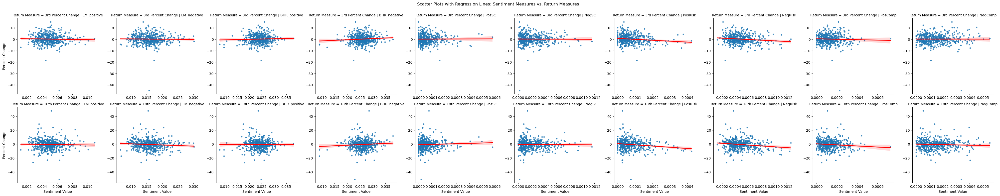

```python
import fnmatch
import glob
import os
import re
from time import sleep
from zipfile import ZipFile

import numpy as np
import pandas as pd
from bs4 import BeautifulSoup
from utils.near_regex import * 
from tqdm import tqdm  
from sec_edgar_downloader import Downloader
from requests_html import HTMLSession
import shutil

os.makedirs("output", exist_ok=True)
```


```python
#load in the s&p 500 data csv
sp500_file = 'inputs/sp500_2022.csv'

# get it if we haven't 
if not os.path.exists(sp500_file):
    # 2022 dec version of page
    url = 'https://en.wikipedia.org/w/index.php?title=List_of_S%26P_500_companies&oldid=1130173030'
    pd.read_html(url)[0].to_csv(sp500_file,index=False)

# load and look at it
sp500 = pd.read_csv(sp500_file)    
```


```python
dl = Downloader("Evan Trock", 
                "ert226@lehigh.edu",
                "10k_files")
```


```python
if not os.path.exists('10k_files/10k_files.zip'):
    
    for cik in tqdm(sp500['CIK'][:503]):
         
        firm_folder = f'10k_files/sec-edgar-filings/{str(cik).zfill(10)}/'  # str(cik).zfill(10)   means that CIK 1234 becomes 0000001234

        # if I haven't downloaded any HTML for this firm (len=0 files on this pattern), do so
        # you could make this more precise and only look for filings during 2022 (if you were downloading across many years)
        
        if len(glob.glob(firm_folder + '/10-K/*/*.html')) == 0:
            
            dl.get("10-K", cik, 
                   limit=1,                  # get the latest filing within window
                   after="2022-01-01",       # does this download filings ON 1/1 or nah? (check)
                   before="2022-12-31",      # does this download filings ON 12/31 or nah? (check)
                   download_details =True    # download the html 
            ) 
    
        # delete the txt files as we go!!!
        # files are of the form: folder/10-K/*/*.txt
        for txt_f in glob.glob(firm_folder + '/10-K/*/*.txt'):
            os.remove(txt_f) 
```

    100%|██████████| 503/503 [05:53<00:00,  1.42it/s]
    


```python
files = glob.glob('10k_files/sec-edgar-filings/*/10-K/*/*.html')
files = [file.replace('\\', '/') for file in files]
#f'We have {len(files)} HTML files for {len(sp500["CIK"])} firms'
files
```


    ['10k_files/sec-edgar-filings/0000001800/10-K/0001104659-22-025141/primary-document.html',
     '10k_files/sec-edgar-filings/0000002488/10-K/0000002488-22-000016/primary-document.html',
     '10k_files/sec-edgar-filings/0000002969/10-K/0000002969-22-000054/primary-document.html',
     '10k_files/sec-edgar-filings/0000004127/10-K/0000004127-22-000038/primary-document.html',
     '10k_files/sec-edgar-filings/0000004281/10-K/0000004281-22-000004/primary-document.html',
     '10k_files/sec-edgar-filings/0000004447/10-K/0001628280-22-004524/primary-document.html',
     '10k_files/sec-edgar-filings/0000004904/10-K/0000004904-22-000024/primary-document.html',
     '10k_files/sec-edgar-filings/0000004962/10-K/0000004962-22-000008/primary-document.html',
     '10k_files/sec-edgar-filings/0000004977/10-K/0000004977-22-000058/primary-document.html',
     '10k_files/sec-edgar-filings/0000005272/10-K/0001104659-22-024701/primary-document.html',
     '10k_files/sec-edgar-filings/0000006201/10-K/0000006201-22-000026/primary-document.html',
     '10k_files/sec-edgar-filings/0000006281/10-K/0000006281-22-000250/primary-document.html',
     '10k_files/sec-edgar-filings/0000006951/10-K/0000006951-22-000043/primary-document.html',
     '10k_files/sec-edgar-filings/0000007084/10-K/0000007084-22-000008/primary-document.html',
     '10k_files/sec-edgar-filings/0000008670/10-K/0000008670-22-000038/primary-document.html',
     '10k_files/sec-edgar-filings/0000008818/10-K/0001193125-22-049910/primary-document.html',
     '10k_files/sec-edgar-filings/0000009389/10-K/0001558370-22-001251/primary-document.html',
     '10k_files/sec-edgar-filings/0000010456/10-K/0001628280-22-003432/primary-document.html',
     '10k_files/sec-edgar-filings/0000010795/10-K/0001628280-22-030686/primary-document.html',
     '10k_files/sec-edgar-filings/0000011544/10-K/0000011544-22-000007/primary-document.html',
     '10k_files/sec-edgar-filings/0000012208/10-K/0000012208-22-000011/primary-document.html',
     '10k_files/sec-edgar-filings/0000012927/10-K/0000012927-22-000010/primary-document.html',
     '10k_files/sec-edgar-filings/0000014272/10-K/0000014272-22-000051/primary-document.html',
     '10k_files/sec-edgar-filings/0000014693/10-K/0000014693-22-000069/primary-document.html',
     '10k_files/sec-edgar-filings/0000016732/10-K/0000016732-22-000093/primary-document.html',
     '10k_files/sec-edgar-filings/0000016918/10-K/0000016918-22-000069/primary-document.html',
     '10k_files/sec-edgar-filings/0000018230/10-K/0000018230-22-000050/primary-document.html',
     '10k_files/sec-edgar-filings/0000018926/10-K/0000018926-22-000007/primary-document.html',
     '10k_files/sec-edgar-filings/0000019617/10-K/0000019617-22-000272/primary-document.html',
     '10k_files/sec-edgar-filings/0000020286/10-K/0000020286-22-000012/primary-document.html',
     '10k_files/sec-edgar-filings/0000021076/10-K/0000021076-22-000026/primary-document.html',
     '10k_files/sec-edgar-filings/0000021344/10-K/0000021344-22-000009/primary-document.html',
     '10k_files/sec-edgar-filings/0000021665/10-K/0000021665-22-000003/primary-document.html',
     '10k_files/sec-edgar-filings/0000023217/10-K/0001437749-22-017530/primary-document.html',
     '10k_files/sec-edgar-filings/0000024545/10-K/0000024545-22-000005/primary-document.html',
     '10k_files/sec-edgar-filings/0000024741/10-K/0001437749-22-003247/primary-document.html',
     '10k_files/sec-edgar-filings/0000026172/10-K/0000026172-22-000008/primary-document.html',
     '10k_files/sec-edgar-filings/0000027419/10-K/0000027419-22-000007/primary-document.html',
     '10k_files/sec-edgar-filings/0000027904/10-K/0000027904-22-000003/primary-document.html',
     '10k_files/sec-edgar-filings/0000028412/10-K/0000028412-22-000067/primary-document.html',
     '10k_files/sec-edgar-filings/0000029534/10-K/0001558370-22-003921/primary-document.html',
     '10k_files/sec-edgar-filings/0000029905/10-K/0000029905-22-000009/primary-document.html',
     '10k_files/sec-edgar-filings/0000029989/10-K/0000029989-22-000012/primary-document.html',
     '10k_files/sec-edgar-filings/0000031462/10-K/0001558370-22-002059/primary-document.html',
     '10k_files/sec-edgar-filings/0000031791/10-K/0000031791-22-000003/primary-document.html',
     '10k_files/sec-edgar-filings/0000032604/10-K/0000032604-22-000041/primary-document.html',
     '10k_files/sec-edgar-filings/0000033185/10-K/0000033185-22-000014/primary-document.html',
     '10k_files/sec-edgar-filings/0000033213/10-K/0000033213-22-000007/primary-document.html',
     '10k_files/sec-edgar-filings/0000034088/10-K/0000034088-22-000011/primary-document.html',
     '10k_files/sec-edgar-filings/0000034903/10-K/0000034903-22-000023/primary-document.html',
     '10k_files/sec-edgar-filings/0000035527/10-K/0000035527-22-000119/primary-document.html',
     '10k_files/sec-edgar-filings/0000036104/10-K/0001193125-22-048709/primary-document.html',
     '10k_files/sec-edgar-filings/0000036270/10-K/0001564590-22-005400/primary-document.html',
     '10k_files/sec-edgar-filings/0000037785/10-K/0000037785-22-000025/primary-document.html',
     '10k_files/sec-edgar-filings/0000037996/10-K/0000037996-22-000013/primary-document.html',
     '10k_files/sec-edgar-filings/0000038777/10-K/0000038777-22-000198/primary-document.html',
     '10k_files/sec-edgar-filings/0000040533/10-K/0000040533-22-000007/primary-document.html',
     '10k_files/sec-edgar-filings/0000040545/10-K/0000040545-22-000008/primary-document.html',
     '10k_files/sec-edgar-filings/0000040704/10-K/0001193125-22-185257/primary-document.html',
     '10k_files/sec-edgar-filings/0000040987/10-K/0000040987-22-000013/primary-document.html',
     '10k_files/sec-edgar-filings/0000045012/10-K/0000045012-22-000013/primary-document.html',
     '10k_files/sec-edgar-filings/0000046080/10-K/0000046080-22-000023/primary-document.html',
     '10k_files/sec-edgar-filings/0000047111/10-K/0000047111-22-000017/primary-document.html',
     '10k_files/sec-edgar-filings/0000047217/10-K/0000047217-22-000068/primary-document.html',
     '10k_files/sec-edgar-filings/0000048465/10-K/0000048465-22-000051/primary-document.html',
     '10k_files/sec-edgar-filings/0000049071/10-K/0000049071-22-000017/primary-document.html',
     '10k_files/sec-edgar-filings/0000049196/10-K/0000049196-22-000023/primary-document.html',
     '10k_files/sec-edgar-filings/0000049826/10-K/0000049826-22-000006/primary-document.html',
     '10k_files/sec-edgar-filings/0000050863/10-K/0000050863-22-000007/primary-document.html',
     '10k_files/sec-edgar-filings/0000051143/10-K/0001558370-22-001584/primary-document.html',
     '10k_files/sec-edgar-filings/0000051253/10-K/0000051253-22-000007/primary-document.html',
     '10k_files/sec-edgar-filings/0000051434/10-K/0000051434-22-000016/primary-document.html',
     '10k_files/sec-edgar-filings/0000051644/10-K/0000051644-22-000010/primary-document.html',
     '10k_files/sec-edgar-filings/0000052988/10-K/0000052988-22-000111/primary-document.html',
     '10k_files/sec-edgar-filings/0000055067/10-K/0001628280-22-003345/primary-document.html',
     '10k_files/sec-edgar-filings/0000055785/10-K/0000055785-22-000010/primary-document.html',
     '10k_files/sec-edgar-filings/0000056873/10-K/0001558370-22-004595/primary-document.html',
     '10k_files/sec-edgar-filings/0000059478/10-K/0000059478-22-000068/primary-document.html',
     '10k_files/sec-edgar-filings/0000059558/10-K/0000059558-22-000008/primary-document.html',
     '10k_files/sec-edgar-filings/0000060086/10-K/0000060086-22-000007/primary-document.html',
     '10k_files/sec-edgar-filings/0000060667/10-K/0000060667-22-000038/primary-document.html',
     '10k_files/sec-edgar-filings/0000062709/10-K/0000062709-22-000009/primary-document.html',
     '10k_files/sec-edgar-filings/0000062996/10-K/0000062996-22-000011/primary-document.html',
     '10k_files/sec-edgar-filings/0000063754/10-K/0000063754-22-000005/primary-document.html',
     '10k_files/sec-edgar-filings/0000063908/10-K/0000063908-22-000011/primary-document.html',
     '10k_files/sec-edgar-filings/0000064040/10-K/0000064040-22-000055/primary-document.html',
     '10k_files/sec-edgar-filings/0000064803/10-K/0000064803-22-000008/primary-document.html',
     '10k_files/sec-edgar-filings/0000065984/10-K/0000065984-22-000017/primary-document.html',
     '10k_files/sec-edgar-filings/0000066740/10-K/0000066740-22-000010/primary-document.html',
     '10k_files/sec-edgar-filings/0000068505/10-K/0000068505-22-000010/primary-document.html',
     '10k_files/sec-edgar-filings/0000070858/10-K/0000070858-22-000062/primary-document.html',
     '10k_files/sec-edgar-filings/0000072331/10-K/0000072331-22-000185/primary-document.html',
     '10k_files/sec-edgar-filings/0000072741/10-K/0000072741-22-000015/primary-document.html',
     '10k_files/sec-edgar-filings/0000072903/10-K/0000072903-22-000010/primary-document.html',
     '10k_files/sec-edgar-filings/0000072971/10-K/0000072971-22-000096/primary-document.html',
     '10k_files/sec-edgar-filings/0000073124/10-K/0000073124-22-000071/primary-document.html',
     '10k_files/sec-edgar-filings/0000073309/10-K/0001564590-22-007679/primary-document.html',
     '10k_files/sec-edgar-filings/0000074208/10-K/0000074208-22-000010/primary-document.html',
     '10k_files/sec-edgar-filings/0000075362/10-K/0001564590-22-006237/primary-document.html',
     '10k_files/sec-edgar-filings/0000075677/10-K/0000950170-22-001913/primary-document.html',
     '10k_files/sec-edgar-filings/0000076334/10-K/0000076334-22-000034/primary-document.html',
     '10k_files/sec-edgar-filings/0000077360/10-K/0000077360-22-000006/primary-document.html',
     '10k_files/sec-edgar-filings/0000077476/10-K/0000077476-22-000010/primary-document.html',
     '10k_files/sec-edgar-filings/0000078003/10-K/0000078003-22-000027/primary-document.html',
     '10k_files/sec-edgar-filings/0000079282/10-K/0000950170-22-001654/primary-document.html',
     '10k_files/sec-edgar-filings/0000079879/10-K/0000079879-22-000009/primary-document.html',
     '10k_files/sec-edgar-filings/0000080424/10-K/0000080424-22-000064/primary-document.html',
     '10k_files/sec-edgar-filings/0000080661/10-K/0000080661-22-000046/primary-document.html',
     '10k_files/sec-edgar-filings/0000084839/10-K/0000084839-22-000011/primary-document.html',
     '10k_files/sec-edgar-filings/0000086312/10-K/0000086312-22-000013/primary-document.html',
     '10k_files/sec-edgar-filings/0000087347/10-K/0001564590-22-002421/primary-document.html',
     '10k_files/sec-edgar-filings/0000089800/10-K/0000089800-22-000007/primary-document.html',
     '10k_files/sec-edgar-filings/0000091142/10-K/0000091142-22-000028/primary-document.html',
     '10k_files/sec-edgar-filings/0000091419/10-K/0000091419-22-000049/primary-document.html',
     '10k_files/sec-edgar-filings/0000091440/10-K/0000091440-22-000005/primary-document.html',
     '10k_files/sec-edgar-filings/0000091576/10-K/0000091576-22-000029/primary-document.html',
     '10k_files/sec-edgar-filings/0000092122/10-K/0000092122-22-000003/primary-document.html',
     '10k_files/sec-edgar-filings/0000092230/10-K/0000092230-22-000008/primary-document.html',
     '10k_files/sec-edgar-filings/0000092380/10-K/0000092380-22-000007/primary-document.html',
     '10k_files/sec-edgar-filings/0000093410/10-K/0000093410-22-000019/primary-document.html',
     '10k_files/sec-edgar-filings/0000093556/10-K/0000093556-22-000015/primary-document.html',
     '10k_files/sec-edgar-filings/0000093751/10-K/0000093751-22-000424/primary-document.html',
     '10k_files/sec-edgar-filings/0000096021/10-K/0000096021-22-000151/primary-document.html',
     '10k_files/sec-edgar-filings/0000096943/10-K/0000096943-22-000016/primary-document.html',
     '10k_files/sec-edgar-filings/0000097210/10-K/0001193125-22-049828/primary-document.html',
     '10k_files/sec-edgar-filings/0000097476/10-K/0000097476-22-000009/primary-document.html',
     '10k_files/sec-edgar-filings/0000097745/10-K/0000097745-22-000011/primary-document.html',
     '10k_files/sec-edgar-filings/0000100493/10-K/0000100493-22-000097/primary-document.html',
     '10k_files/sec-edgar-filings/0000100517/10-K/0000100517-22-000009/primary-document.html',
     '10k_files/sec-edgar-filings/0000100885/10-K/0001437749-22-002494/primary-document.html',
     '10k_files/sec-edgar-filings/0000101778/10-K/0000101778-22-000016/primary-document.html',
     '10k_files/sec-edgar-filings/0000101829/10-K/0000101829-22-000005/primary-document.html',
     '10k_files/sec-edgar-filings/0000103379/10-K/0000103379-22-000006/primary-document.html',
     '10k_files/sec-edgar-filings/0000104169/10-K/0000104169-22-000012/primary-document.html',
     '10k_files/sec-edgar-filings/0000105770/10-K/0001628280-22-003342/primary-document.html',
     '10k_files/sec-edgar-filings/0000106040/10-K/0000106040-22-000055/primary-document.html',
     '10k_files/sec-edgar-filings/0000106535/10-K/0001564590-22-005707/primary-document.html',
     '10k_files/sec-edgar-filings/0000106640/10-K/0000106640-22-000015/primary-document.html',
     '10k_files/sec-edgar-filings/0000107263/10-K/0000107263-22-000007/primary-document.html',
     '10k_files/sec-edgar-filings/0000109198/10-K/0000109198-22-000008/primary-document.html',
     '10k_files/sec-edgar-filings/0000109380/10-K/0000109380-22-000072/primary-document.html',
     '10k_files/sec-edgar-filings/0000200406/10-K/0000200406-22-000022/primary-document.html',
     '10k_files/sec-edgar-filings/0000202058/10-K/0000202058-22-000015/primary-document.html',
     '10k_files/sec-edgar-filings/0000217346/10-K/0000217346-22-000005/primary-document.html',
     '10k_files/sec-edgar-filings/0000277135/10-K/0000277135-22-000012/primary-document.html',
     '10k_files/sec-edgar-filings/0000277948/10-K/0000277948-22-000009/primary-document.html',
     '10k_files/sec-edgar-filings/0000310158/10-K/0000310158-22-000003/primary-document.html',
     '10k_files/sec-edgar-filings/0000310764/10-K/0000310764-22-000028/primary-document.html',
     '10k_files/sec-edgar-filings/0000313616/10-K/0000313616-22-000061/primary-document.html',
     '10k_files/sec-edgar-filings/0000313927/10-K/0001564590-22-005528/primary-document.html',
     '10k_files/sec-edgar-filings/0000315189/10-K/0001558370-22-018703/primary-document.html',
     '10k_files/sec-edgar-filings/0000315213/10-K/0000315213-22-000018/primary-document.html',
     '10k_files/sec-edgar-filings/0000315293/10-K/0001628280-22-003180/primary-document.html',
     '10k_files/sec-edgar-filings/0000316709/10-K/0000316709-22-000009/primary-document.html',
     '10k_files/sec-edgar-filings/0000318154/10-K/0000318154-22-000010/primary-document.html',
     '10k_files/sec-edgar-filings/0000319201/10-K/0000319201-22-000023/primary-document.html',
     '10k_files/sec-edgar-filings/0000320187/10-K/0000320187-22-000038/primary-document.html',
     '10k_files/sec-edgar-filings/0000320193/10-K/0000320193-22-000108/primary-document.html',
     '10k_files/sec-edgar-filings/0000320335/10-K/0000320335-22-000006/primary-document.html',
     '10k_files/sec-edgar-filings/0000352541/10-K/0000352541-22-000020/primary-document.html',
     '10k_files/sec-edgar-filings/0000352915/10-K/0001564590-22-006717/primary-document.html',
     '10k_files/sec-edgar-filings/0000354190/10-K/0001564590-22-005714/primary-document.html',
     '10k_files/sec-edgar-filings/0000354950/10-K/0000354950-22-000070/primary-document.html',
     '10k_files/sec-edgar-filings/0000701985/10-K/0000701985-22-000009/primary-document.html',
     '10k_files/sec-edgar-filings/0000702165/10-K/0000702165-22-000007/primary-document.html',
     '10k_files/sec-edgar-filings/0000707549/10-K/0000707549-22-000107/primary-document.html',
     '10k_files/sec-edgar-filings/0000711404/10-K/0000711404-22-000053/primary-document.html',
     '10k_files/sec-edgar-filings/0000712515/10-K/0000712515-22-000011/primary-document.html',
     '10k_files/sec-edgar-filings/0000713676/10-K/0000713676-22-000019/primary-document.html',
     '10k_files/sec-edgar-filings/0000715957/10-K/0001564590-22-006589/primary-document.html',
     '10k_files/sec-edgar-filings/0000718877/10-K/0001628280-22-003992/primary-document.html',
     '10k_files/sec-edgar-filings/0000719739/10-K/0000719739-22-000023/primary-document.html',
     '10k_files/sec-edgar-filings/0000720005/10-K/0000720005-22-000066/primary-document.html',
     '10k_files/sec-edgar-filings/0000721371/10-K/0000721371-22-000058/primary-document.html',
     '10k_files/sec-edgar-filings/0000723125/10-K/0000723125-22-000048/primary-document.html',
     '10k_files/sec-edgar-filings/0000723254/10-K/0000723254-22-000019/primary-document.html',
     '10k_files/sec-edgar-filings/0000723531/10-K/0000950170-22-012734/primary-document.html',
     '10k_files/sec-edgar-filings/0000726728/10-K/0000726728-22-000046/primary-document.html',
     '10k_files/sec-edgar-filings/0000728535/10-K/0001437749-22-004457/primary-document.html',
     '10k_files/sec-edgar-filings/0000731766/10-K/0000731766-22-000008/primary-document.html',
     '10k_files/sec-edgar-filings/0000731802/10-K/0000731802-22-000037/primary-document.html',
     '10k_files/sec-edgar-filings/0000732712/10-K/0000732712-22-000008/primary-document.html',
     '10k_files/sec-edgar-filings/0000732717/10-K/0000732717-22-000015/primary-document.html',
     '10k_files/sec-edgar-filings/0000740260/10-K/0000740260-22-000057/primary-document.html',
     '10k_files/sec-edgar-filings/0000745732/10-K/0000745732-22-000014/primary-document.html',
     '10k_files/sec-edgar-filings/0000746515/10-K/0001564590-22-010381/primary-document.html',
     '10k_files/sec-edgar-filings/0000749251/10-K/0000749251-22-000006/primary-document.html',
     '10k_files/sec-edgar-filings/0000753308/10-K/0000753308-22-000014/primary-document.html',
     '10k_files/sec-edgar-filings/0000759944/10-K/0000759944-22-000025/primary-document.html',
     '10k_files/sec-edgar-filings/0000764180/10-K/0000764180-22-000019/primary-document.html',
     '10k_files/sec-edgar-filings/0000764478/10-K/0000764478-22-000008/primary-document.html',
     '10k_files/sec-edgar-filings/0000764622/10-K/0000764622-22-000014/primary-document.html',
     '10k_files/sec-edgar-filings/0000765880/10-K/0001628280-22-002117/primary-document.html',
     '10k_files/sec-edgar-filings/0000766421/10-K/0000766421-22-000009/primary-document.html',
     '10k_files/sec-edgar-filings/0000766704/10-K/0000766704-22-000013/primary-document.html',
     '10k_files/sec-edgar-filings/0000769397/10-K/0000769397-22-000019/primary-document.html',
     '10k_files/sec-edgar-filings/0000773840/10-K/0000773840-22-000018/primary-document.html',
     '10k_files/sec-edgar-filings/0000779152/10-K/0000779152-22-000076/primary-document.html',
     '10k_files/sec-edgar-filings/0000783325/10-K/0000107815-22-000116/primary-document.html',
     '10k_files/sec-edgar-filings/0000788784/10-K/0001628280-22-003860/primary-document.html',
     '10k_files/sec-edgar-filings/0000789019/10-K/0001564590-22-026876/primary-document.html',
     '10k_files/sec-edgar-filings/0000789570/10-K/0000789570-22-000005/primary-document.html',
     '10k_files/sec-edgar-filings/0000796343/10-K/0000796343-22-000032/primary-document.html',
     '10k_files/sec-edgar-filings/0000797468/10-K/0000797468-22-000008/primary-document.html',
     '10k_files/sec-edgar-filings/0000798354/10-K/0000798354-22-000004/primary-document.html',
     '10k_files/sec-edgar-filings/0000804328/10-K/0000804328-22-000021/primary-document.html',
     '10k_files/sec-edgar-filings/0000811156/10-K/0000811156-22-000048/primary-document.html',
     '10k_files/sec-edgar-filings/0000813672/10-K/0000813672-22-000012/primary-document.html',
     '10k_files/sec-edgar-filings/0000813828/10-K/0000813828-22-000005/primary-document.html',
     '10k_files/sec-edgar-filings/0000814453/10-K/0000814453-22-000017/primary-document.html',
     '10k_files/sec-edgar-filings/0000815097/10-K/0000815097-22-000009/primary-document.html',
     '10k_files/sec-edgar-filings/0000815556/10-K/0000815556-22-000009/primary-document.html',
     '10k_files/sec-edgar-filings/0000818479/10-K/0000818479-22-000015/primary-document.html',
     '10k_files/sec-edgar-filings/0000820027/10-K/0000820027-22-000016/primary-document.html',
     '10k_files/sec-edgar-filings/0000820313/10-K/0001558370-22-000961/primary-document.html',
     '10k_files/sec-edgar-filings/0000821189/10-K/0000821189-22-000017/primary-document.html',
     '10k_files/sec-edgar-filings/0000822416/10-K/0000822416-22-000007/primary-document.html',
     '10k_files/sec-edgar-filings/0000823768/10-K/0001558370-22-001179/primary-document.html',
     '10k_files/sec-edgar-filings/0000827052/10-K/0000827052-22-000006/primary-document.html',
     '10k_files/sec-edgar-filings/0000827054/10-K/0000827054-22-000094/primary-document.html',
     '10k_files/sec-edgar-filings/0000829224/10-K/0000829224-22-000058/primary-document.html',
     '10k_files/sec-edgar-filings/0000831001/10-K/0000831001-22-000036/primary-document.html',
     '10k_files/sec-edgar-filings/0000831259/10-K/0000831259-22-000009/primary-document.html',
     '10k_files/sec-edgar-filings/0000832101/10-K/0000832101-22-000008/primary-document.html',
     '10k_files/sec-edgar-filings/0000833444/10-K/0000833444-22-000043/primary-document.html',
     '10k_files/sec-edgar-filings/0000842023/10-K/0001558370-22-013935/primary-document.html',
     '10k_files/sec-edgar-filings/0000849399/10-K/0000849399-22-000013/primary-document.html',
     '10k_files/sec-edgar-filings/0000851968/10-K/0000851968-22-000026/primary-document.html',
     '10k_files/sec-edgar-filings/0000857005/10-K/0000950170-22-025211/primary-document.html',
     '10k_files/sec-edgar-filings/0000858470/10-K/0000858470-22-000009/primary-document.html',
     '10k_files/sec-edgar-filings/0000858877/10-K/0000858877-22-000013/primary-document.html',
     '10k_files/sec-edgar-filings/0000859737/10-K/0000859737-22-000022/primary-document.html',
     '10k_files/sec-edgar-filings/0000860730/10-K/0001193125-22-046707/primary-document.html',
     '10k_files/sec-edgar-filings/0000860731/10-K/0000860731-22-000011/primary-document.html',
     '10k_files/sec-edgar-filings/0000864749/10-K/0000864749-22-000044/primary-document.html',
     '10k_files/sec-edgar-filings/0000865752/10-K/0001104659-22-028182/primary-document.html',
     '10k_files/sec-edgar-filings/0000866787/10-K/0001558370-22-015239/primary-document.html',
     '10k_files/sec-edgar-filings/0000872589/10-K/0001804220-22-000007/primary-document.html',
     '10k_files/sec-edgar-filings/0000874716/10-K/0000874716-22-000007/primary-document.html',
     '10k_files/sec-edgar-filings/0000874761/10-K/0000874761-22-000022/primary-document.html',
     '10k_files/sec-edgar-filings/0000874766/10-K/0000874766-22-000019/primary-document.html',
     '10k_files/sec-edgar-filings/0000875045/10-K/0000875045-22-000007/primary-document.html',
     '10k_files/sec-edgar-filings/0000875320/10-K/0000875320-22-000007/primary-document.html',
     '10k_files/sec-edgar-filings/0000877212/10-K/0000877212-22-000026/primary-document.html',
     '10k_files/sec-edgar-filings/0000878927/10-K/0001564590-22-006303/primary-document.html',
     '10k_files/sec-edgar-filings/0000879101/10-K/0001437749-22-004700/primary-document.html',
     '10k_files/sec-edgar-filings/0000879169/10-K/0001558370-22-000902/primary-document.html',
     '10k_files/sec-edgar-filings/0000882095/10-K/0000882095-22-000007/primary-document.html',
     '10k_files/sec-edgar-filings/0000882184/10-K/0000882184-22-000184/primary-document.html',
     '10k_files/sec-edgar-filings/0000882835/10-K/0000882835-22-000012/primary-document.html',
     '10k_files/sec-edgar-filings/0000883241/10-K/0000883241-22-000017/primary-document.html',
     '10k_files/sec-edgar-filings/0000884887/10-K/0000884887-22-000008/primary-document.html',
     '10k_files/sec-edgar-filings/0000885725/10-K/0000885725-22-000006/primary-document.html',
     '10k_files/sec-edgar-filings/0000886982/10-K/0001193125-22-052682/primary-document.html',
     '10k_files/sec-edgar-filings/0000891103/10-K/0000891103-22-000020/primary-document.html',
     '10k_files/sec-edgar-filings/0000895421/10-K/0000895421-22-000400/primary-document.html',
     '10k_files/sec-edgar-filings/0000896159/10-K/0000896159-22-000005/primary-document.html',
     '10k_files/sec-edgar-filings/0000896878/10-K/0000896878-22-000028/primary-document.html',
     '10k_files/sec-edgar-filings/0000898173/10-K/0000898173-22-000012/primary-document.html',
     '10k_files/sec-edgar-filings/0000899051/10-K/0000899051-22-000015/primary-document.html',
     '10k_files/sec-edgar-filings/0000899689/10-K/0000899689-22-000006/primary-document.html',
     '10k_files/sec-edgar-filings/0000900075/10-K/0000900075-22-000050/primary-document.html',
     '10k_files/sec-edgar-filings/0000906107/10-K/0001564590-22-005566/primary-document.html',
     '10k_files/sec-edgar-filings/0000906163/10-K/0000906163-22-000008/primary-document.html',
     '10k_files/sec-edgar-filings/0000906345/10-K/0000906345-22-000009/primary-document.html',
     '10k_files/sec-edgar-filings/0000908255/10-K/0000908255-22-000009/primary-document.html',
     '10k_files/sec-edgar-filings/0000909832/10-K/0000909832-22-000021/primary-document.html',
     '10k_files/sec-edgar-filings/0000910606/10-K/0000950170-22-001418/primary-document.html',
     '10k_files/sec-edgar-filings/0000912595/10-K/0000950170-22-001423/primary-document.html',
     '10k_files/sec-edgar-filings/0000914208/10-K/0000914208-22-000319/primary-document.html',
     '10k_files/sec-edgar-filings/0000915389/10-K/0000915389-22-000010/primary-document.html',
     '10k_files/sec-edgar-filings/0000915912/10-K/0000915912-22-000005/primary-document.html',
     '10k_files/sec-edgar-filings/0000915913/10-K/0000915913-22-000027/primary-document.html',
     '10k_files/sec-edgar-filings/0000916076/10-K/0001564590-22-005965/primary-document.html',
     '10k_files/sec-edgar-filings/0000916365/10-K/0000916365-22-000049/primary-document.html',
     '10k_files/sec-edgar-filings/0000920148/10-K/0000920148-22-000015/primary-document.html',
     '10k_files/sec-edgar-filings/0000920522/10-K/0000920522-22-000019/primary-document.html',
     '10k_files/sec-edgar-filings/0000920760/10-K/0001628280-22-001450/primary-document.html',
     '10k_files/sec-edgar-filings/0000922224/10-K/0000922224-22-000005/primary-document.html',
     '10k_files/sec-edgar-filings/0000927066/10-K/0000927066-22-000012/primary-document.html',
     '10k_files/sec-edgar-filings/0000927628/10-K/0000927628-22-000106/primary-document.html',
     '10k_files/sec-edgar-filings/0000927653/10-K/0000927653-22-000051/primary-document.html',
     '10k_files/sec-edgar-filings/0000935703/10-K/0000935703-22-000020/primary-document.html',
     '10k_files/sec-edgar-filings/0000936340/10-K/0000936340-22-000077/primary-document.html',
     '10k_files/sec-edgar-filings/0000936468/10-K/0000936468-22-000008/primary-document.html',
     '10k_files/sec-edgar-filings/0000940944/10-K/0000940944-22-000042/primary-document.html',
     '10k_files/sec-edgar-filings/0000943452/10-K/0001628280-22-002997/primary-document.html',
     '10k_files/sec-edgar-filings/0000943819/10-K/0000943819-22-000010/primary-document.html',
     '10k_files/sec-edgar-filings/0000945841/10-K/0000945841-22-000023/primary-document.html',
     '10k_files/sec-edgar-filings/0000946581/10-K/0001628280-22-014580/primary-document.html',
     '10k_files/sec-edgar-filings/0000947484/10-K/0000947484-22-000015/primary-document.html',
     '10k_files/sec-edgar-filings/0001000228/10-K/0001000228-22-000016/primary-document.html',
     '10k_files/sec-edgar-filings/0001000697/10-K/0001193125-22-051509/primary-document.html',
     '10k_files/sec-edgar-filings/0001001082/10-K/0001558370-22-001816/primary-document.html',
     '10k_files/sec-edgar-filings/0001001250/10-K/0001001250-22-000122/primary-document.html',
     '10k_files/sec-edgar-filings/0001002047/10-K/0000950170-22-011708/primary-document.html',
     '10k_files/sec-edgar-filings/0001002910/10-K/0001002910-22-000038/primary-document.html',
     '10k_files/sec-edgar-filings/0001004980/10-K/0001004980-22-000009/primary-document.html',
     '10k_files/sec-edgar-filings/0001012100/10-K/0001628280-22-003294/primary-document.html',
     '10k_files/sec-edgar-filings/0001013237/10-K/0001013237-22-000159/primary-document.html',
     '10k_files/sec-edgar-filings/0001013462/10-K/0001013462-22-000005/primary-document.html',
     '10k_files/sec-edgar-filings/0001013871/10-K/0001013871-22-000010/primary-document.html',
     '10k_files/sec-edgar-filings/0001014473/10-K/0001014473-22-000007/primary-document.html',
     '10k_files/sec-edgar-filings/0001018724/10-K/0001018724-22-000005/primary-document.html',
     '10k_files/sec-edgar-filings/0001020569/10-K/0001020569-22-000035/primary-document.html',
     '10k_files/sec-edgar-filings/0001022079/10-K/0001022079-22-000027/primary-document.html',
     '10k_files/sec-edgar-filings/0001022671/10-K/0001558370-22-002377/primary-document.html',
     '10k_files/sec-edgar-filings/0001024478/10-K/0001024478-22-000093/primary-document.html',
     '10k_files/sec-edgar-filings/0001031296/10-K/0001031296-22-000013/primary-document.html',
     '10k_files/sec-edgar-filings/0001032208/10-K/0001032208-22-000007/primary-document.html',
     '10k_files/sec-edgar-filings/0001034054/10-K/0001034054-22-000002/primary-document.html',
     '10k_files/sec-edgar-filings/0001035002/10-K/0001035002-22-000007/primary-document.html',
     '10k_files/sec-edgar-filings/0001035267/10-K/0001035267-22-000014/primary-document.html',
     '10k_files/sec-edgar-filings/0001035443/10-K/0001035443-22-000040/primary-document.html',
     '10k_files/sec-edgar-filings/0001037038/10-K/0001037038-22-000014/primary-document.html',
     '10k_files/sec-edgar-filings/0001037540/10-K/0001656423-22-000013/primary-document.html',
     '10k_files/sec-edgar-filings/0001037646/10-K/0001037646-22-000008/primary-document.html',
     '10k_files/sec-edgar-filings/0001037868/10-K/0001037868-22-000009/primary-document.html',
     '10k_files/sec-edgar-filings/0001038357/10-K/0001038357-22-000039/primary-document.html',
     '10k_files/sec-edgar-filings/0001039684/10-K/0001039684-22-000015/primary-document.html',
     '10k_files/sec-edgar-filings/0001041061/10-K/0001041061-22-000009/primary-document.html',
     '10k_files/sec-edgar-filings/0001043277/10-K/0001043277-22-000006/primary-document.html',
     '10k_files/sec-edgar-filings/0001043604/10-K/0001043604-22-000017/primary-document.html',
     '10k_files/sec-edgar-filings/0001045609/10-K/0001564590-22-004436/primary-document.html',
     '10k_files/sec-edgar-filings/0001045810/10-K/0001045810-22-000036/primary-document.html',
     '10k_files/sec-edgar-filings/0001047862/10-K/0001047862-22-000039/primary-document.html',
     '10k_files/sec-edgar-filings/0001048286/10-K/0001628280-22-002666/primary-document.html',
     '10k_files/sec-edgar-filings/0001048695/10-K/0001048695-22-000033/primary-document.html',
     '10k_files/sec-edgar-filings/0001048911/10-K/0000950170-22-012762/primary-document.html',
     '10k_files/sec-edgar-filings/0001050915/10-K/0001050915-22-000008/primary-document.html',
     '10k_files/sec-edgar-filings/0001051470/10-K/0001051470-22-000019/primary-document.html',
     '10k_files/sec-edgar-filings/0001053507/10-K/0001053507-22-000017/primary-document.html',
     '10k_files/sec-edgar-filings/0001057352/10-K/0001057352-22-000027/primary-document.html',
     '10k_files/sec-edgar-filings/0001058090/10-K/0001058090-22-000011/primary-document.html',
     '10k_files/sec-edgar-filings/0001058290/10-K/0001058290-22-000023/primary-document.html',
     '10k_files/sec-edgar-filings/0001059556/10-K/0001059556-22-000012/primary-document.html',
     '10k_files/sec-edgar-filings/0001060391/10-K/0001060391-22-000007/primary-document.html',
     '10k_files/sec-edgar-filings/0001063761/10-K/0001558370-22-001845/primary-document.html',
     '10k_files/sec-edgar-filings/0001065088/10-K/0001065088-22-000006/primary-document.html',
     '10k_files/sec-edgar-filings/0001065280/10-K/0001065280-22-000036/primary-document.html',
     '10k_files/sec-edgar-filings/0001065696/10-K/0001065696-22-000006/primary-document.html',
     '10k_files/sec-edgar-filings/0001067701/10-K/0001067701-22-000008/primary-document.html',
     '10k_files/sec-edgar-filings/0001067983/10-K/0001564590-22-007322/primary-document.html',
     '10k_files/sec-edgar-filings/0001070750/10-K/0000950170-22-001965/primary-document.html',
     '10k_files/sec-edgar-filings/0001071739/10-K/0001071739-22-000071/primary-document.html',
     '10k_files/sec-edgar-filings/0001075531/10-K/0001075531-22-000008/primary-document.html',
     '10k_files/sec-edgar-filings/0001086222/10-K/0001086222-22-000058/primary-document.html',
     '10k_files/sec-edgar-filings/0001090012/10-K/0001564590-22-005321/primary-document.html',
     '10k_files/sec-edgar-filings/0001090727/10-K/0001090727-22-000007/primary-document.html',
     '10k_files/sec-edgar-filings/0001090872/10-K/0001090872-22-000026/primary-document.html',
     '10k_files/sec-edgar-filings/0001091667/10-K/0001091667-22-000024/primary-document.html',
     '10k_files/sec-edgar-filings/0001093557/10-K/0001093557-22-000014/primary-document.html',
     '10k_files/sec-edgar-filings/0001094285/10-K/0001094285-22-000049/primary-document.html',
     '10k_files/sec-edgar-filings/0001095073/10-K/0001095073-22-000005/primary-document.html',
     '10k_files/sec-edgar-filings/0001097149/10-K/0001097149-22-000011/primary-document.html',
     '10k_files/sec-edgar-filings/0001097864/10-K/0001628280-22-002416/primary-document.html',
     '10k_files/sec-edgar-filings/0001099219/10-K/0001099219-22-000014/primary-document.html',
     '10k_files/sec-edgar-filings/0001099800/10-K/0001099800-22-000005/primary-document.html',
     '10k_files/sec-edgar-filings/0001100682/10-K/0001100682-22-000007/primary-document.html',
     '10k_files/sec-edgar-filings/0001101239/10-K/0001628280-22-003171/primary-document.html',
     '10k_files/sec-edgar-filings/0001103982/10-K/0001103982-22-000003/primary-document.html',
     '10k_files/sec-edgar-filings/0001108524/10-K/0001108524-22-000013/primary-document.html',
     '10k_files/sec-edgar-filings/0001109357/10-K/0001109357-22-000039/primary-document.html',
     '10k_files/sec-edgar-filings/0001110803/10-K/0001110803-22-000013/primary-document.html',
     '10k_files/sec-edgar-filings/0001111711/10-K/0001111711-22-000007/primary-document.html',
     '10k_files/sec-edgar-filings/0001113169/10-K/0001113169-22-000005/primary-document.html',
     '10k_files/sec-edgar-filings/0001116132/10-K/0001116132-22-000018/primary-document.html',
     '10k_files/sec-edgar-filings/0001120193/10-K/0001120193-22-000007/primary-document.html',
     '10k_files/sec-edgar-filings/0001121788/10-K/0000950170-22-001303/primary-document.html',
     '10k_files/sec-edgar-filings/0001123360/10-K/0001123360-22-000007/primary-document.html',
     '10k_files/sec-edgar-filings/0001126328/10-K/0001104659-22-020401/primary-document.html',
     '10k_files/sec-edgar-filings/0001130310/10-K/0001130310-22-000023/primary-document.html',
     '10k_files/sec-edgar-filings/0001133421/10-K/0001133421-22-000004/primary-document.html',
     '10k_files/sec-edgar-filings/0001136869/10-K/0001564590-22-007160/primary-document.html',
     '10k_files/sec-edgar-filings/0001136893/10-K/0001136893-22-000038/primary-document.html',
     '10k_files/sec-edgar-filings/0001137774/10-K/0001137774-22-000038/primary-document.html',
     '10k_files/sec-edgar-filings/0001137789/10-K/0001137789-22-000055/primary-document.html',
     '10k_files/sec-edgar-filings/0001138118/10-K/0001138118-22-000010/primary-document.html',
     '10k_files/sec-edgar-filings/0001140536/10-K/0000950170-22-001932/primary-document.html',
     '10k_files/sec-edgar-filings/0001140859/10-K/0001140859-22-000098/primary-document.html',
     '10k_files/sec-edgar-filings/0001141391/10-K/0001141391-22-000023/primary-document.html',
     '10k_files/sec-edgar-filings/0001156039/10-K/0001156039-22-000009/primary-document.html',
     '10k_files/sec-edgar-filings/0001156375/10-K/0001156375-22-000076/primary-document.html',
     '10k_files/sec-edgar-filings/0001158449/10-K/0001158449-22-000037/primary-document.html',
     '10k_files/sec-edgar-filings/0001163165/10-K/0001562762-22-000031/primary-document.html',
     '10k_files/sec-edgar-filings/0001164727/10-K/0001164727-22-000007/primary-document.html',
     '10k_files/sec-edgar-filings/0001166691/10-K/0001166691-22-000009/primary-document.html',
     '10k_files/sec-edgar-filings/0001170010/10-K/0001170010-22-000017/primary-document.html',
     '10k_files/sec-edgar-filings/0001174922/10-K/0001174922-22-000031/primary-document.html',
     '10k_files/sec-edgar-filings/0001175454/10-K/0001628280-22-004531/primary-document.html',
     '10k_files/sec-edgar-filings/0001179929/10-K/0001179929-22-000025/primary-document.html',
     '10k_files/sec-edgar-filings/0001260221/10-K/0001260221-22-000065/primary-document.html',
     '10k_files/sec-edgar-filings/0001262039/10-K/0001262039-22-000008/primary-document.html',
     '10k_files/sec-edgar-filings/0001267238/10-K/0001267238-22-000006/primary-document.html',
     '10k_files/sec-edgar-filings/0001274494/10-K/0001274494-22-000009/primary-document.html',
     '10k_files/sec-edgar-filings/0001278021/10-K/0000950170-22-001811/primary-document.html',
     '10k_files/sec-edgar-filings/0001280452/10-K/0001437749-22-004460/primary-document.html',
     '10k_files/sec-edgar-filings/0001281761/10-K/0001281761-22-000016/primary-document.html',
     '10k_files/sec-edgar-filings/0001283699/10-K/0001283699-22-000018/primary-document.html',
     '10k_files/sec-edgar-filings/0001285785/10-K/0001618034-22-000004/primary-document.html',
     '10k_files/sec-edgar-filings/0001286681/10-K/0000950170-22-002426/primary-document.html',
     '10k_files/sec-edgar-filings/0001289490/10-K/0001628280-22-004274/primary-document.html',
     '10k_files/sec-edgar-filings/0001297996/10-K/0001558370-22-002195/primary-document.html',
     '10k_files/sec-edgar-filings/0001300514/10-K/0001300514-22-000007/primary-document.html',
     '10k_files/sec-edgar-filings/0001306830/10-K/0001306830-22-000017/primary-document.html',
     '10k_files/sec-edgar-filings/0001318605/10-K/0000950170-22-000796/primary-document.html',
     '10k_files/sec-edgar-filings/0001324404/10-K/0001324404-22-000008/primary-document.html',
     '10k_files/sec-edgar-filings/0001324424/10-K/0001324424-22-000009/primary-document.html',
     '10k_files/sec-edgar-filings/0001326160/10-K/0001326160-22-000072/primary-document.html',
     '10k_files/sec-edgar-filings/0001326801/10-K/0001326801-22-000018/primary-document.html',
     '10k_files/sec-edgar-filings/0001335258/10-K/0001335258-22-000019/primary-document.html',
     '10k_files/sec-edgar-filings/0001336920/10-K/0001336920-22-000007/primary-document.html',
     '10k_files/sec-edgar-filings/0001341439/10-K/0001564590-22-023675/primary-document.html',
     '10k_files/sec-edgar-filings/0001352010/10-K/0001352010-22-000020/primary-document.html',
     '10k_files/sec-edgar-filings/0001364742/10-K/0001564590-22-007117/primary-document.html',
     '10k_files/sec-edgar-filings/0001370637/10-K/0001370637-22-000024/primary-document.html',
     '10k_files/sec-edgar-filings/0001373715/10-K/0001373715-22-000024/primary-document.html',
     '10k_files/sec-edgar-filings/0001374310/10-K/0001558370-22-001386/primary-document.html',
     '10k_files/sec-edgar-filings/0001383312/10-K/0001383312-22-000037/primary-document.html',
     '10k_files/sec-edgar-filings/0001385157/10-K/0001558370-22-017931/primary-document.html',
     '10k_files/sec-edgar-filings/0001389170/10-K/0001564590-22-006563/primary-document.html',
     '10k_files/sec-edgar-filings/0001390777/10-K/0001390777-22-000043/primary-document.html',
     '10k_files/sec-edgar-filings/0001393311/10-K/0001393311-22-000010/primary-document.html',
     '10k_files/sec-edgar-filings/0001393612/10-K/0001393612-22-000007/primary-document.html',
     '10k_files/sec-edgar-filings/0001396009/10-K/0001396009-22-000010/primary-document.html',
     '10k_files/sec-edgar-filings/0001402057/10-K/0001402057-22-000020/primary-document.html',
     '10k_files/sec-edgar-filings/0001403161/10-K/0001403161-22-000081/primary-document.html',
     '10k_files/sec-edgar-filings/0001403568/10-K/0001558370-22-004330/primary-document.html',
     '10k_files/sec-edgar-filings/0001408198/10-K/0001564590-22-004803/primary-document.html',
     '10k_files/sec-edgar-filings/0001410636/10-K/0001410636-22-000048/primary-document.html',
     '10k_files/sec-edgar-filings/0001413329/10-K/0001413329-22-000011/primary-document.html',
     '10k_files/sec-edgar-filings/0001413447/10-K/0001413447-22-000008/primary-document.html',
     '10k_files/sec-edgar-filings/0001418135/10-K/0001418135-22-000005/primary-document.html',
     '10k_files/sec-edgar-filings/0001419612/10-K/0001178913-22-000760/primary-document.html',
     '10k_files/sec-edgar-filings/0001437107/10-K/0001437107-22-000031/primary-document.html',
     '10k_files/sec-edgar-filings/0001442145/10-K/0001437749-22-004083/primary-document.html',
     '10k_files/sec-edgar-filings/0001463101/10-K/0001463101-22-000016/primary-document.html',
     '10k_files/sec-edgar-filings/0001466258/10-K/0001466258-22-000031/primary-document.html',
     '10k_files/sec-edgar-filings/0001467373/10-K/0001467373-22-000295/primary-document.html',
     '10k_files/sec-edgar-filings/0001467858/10-K/0001467858-22-000034/primary-document.html',
     '10k_files/sec-edgar-filings/0001474735/10-K/0001437749-22-004080/primary-document.html',
     '10k_files/sec-edgar-filings/0001478242/10-K/0001478242-22-000041/primary-document.html',
     '10k_files/sec-edgar-filings/0001489393/10-K/0001489393-22-000009/primary-document.html',
     '10k_files/sec-edgar-filings/0001501585/10-K/0001501585-22-000007/primary-document.html',
     '10k_files/sec-edgar-filings/0001506307/10-K/0001506307-22-000018/primary-document.html',
     '10k_files/sec-edgar-filings/0001510295/10-K/0001510295-22-000011/primary-document.html',
     '10k_files/sec-edgar-filings/0001513761/10-K/0001558370-22-002516/primary-document.html',
     '10k_files/sec-edgar-filings/0001521332/10-K/0001521332-22-000010/primary-document.html',
     '10k_files/sec-edgar-filings/0001524472/10-K/0001524472-22-000009/primary-document.html',
     '10k_files/sec-edgar-filings/0001534701/10-K/0001534701-22-000078/primary-document.html',
     '10k_files/sec-edgar-filings/0001539838/10-K/0001539838-22-000008/primary-document.html',
     '10k_files/sec-edgar-filings/0001551152/10-K/0001551152-22-000007/primary-document.html',
     '10k_files/sec-edgar-filings/0001551182/10-K/0001551182-22-000004/primary-document.html',
     '10k_files/sec-edgar-filings/0001555280/10-K/0001555280-22-000078/primary-document.html',
     '10k_files/sec-edgar-filings/0001564708/10-K/0001564708-22-000265/primary-document.html',
     '10k_files/sec-edgar-filings/0001571949/10-K/0001571949-22-000006/primary-document.html',
     '10k_files/sec-edgar-filings/0001579241/10-K/0001579241-22-000019/primary-document.html',
     '10k_files/sec-edgar-filings/0001585689/10-K/0001585689-22-000013/primary-document.html',
     '10k_files/sec-edgar-filings/0001590895/10-K/0001590895-22-000061/primary-document.html',
     '10k_files/sec-edgar-filings/0001590955/10-K/0001564590-22-005562/primary-document.html',
     '10k_files/sec-edgar-filings/0001596532/10-K/0001596532-22-000026/primary-document.html',
     '10k_files/sec-edgar-filings/0001596783/10-K/0001596783-22-000129/primary-document.html',
     '10k_files/sec-edgar-filings/0001601046/10-K/0001601046-22-000161/primary-document.html',
     '10k_files/sec-edgar-filings/0001601712/10-K/0001601712-22-000053/primary-document.html',
     '10k_files/sec-edgar-filings/0001604778/10-K/0001604778-22-000029/primary-document.html',
     '10k_files/sec-edgar-filings/0001613103/10-K/0001613103-22-000023/primary-document.html',
     '10k_files/sec-edgar-filings/0001618921/10-K/0001618921-22-000064/primary-document.html',
     '10k_files/sec-edgar-filings/0001633917/10-K/0001633917-22-000027/primary-document.html',
     '10k_files/sec-edgar-filings/0001637459/10-K/0001637459-22-000018/primary-document.html',
     '10k_files/sec-edgar-filings/0001645590/10-K/0001645590-22-000071/primary-document.html',
     '10k_files/sec-edgar-filings/0001652044/10-K/0001652044-22-000019/primary-document.html',
     '10k_files/sec-edgar-filings/0001659166/10-K/0001659166-22-000054/primary-document.html',
     '10k_files/sec-edgar-filings/0001666700/10-K/0001666700-22-000009/primary-document.html',
     '10k_files/sec-edgar-filings/0001679273/10-K/0001558370-22-011121/primary-document.html',
     '10k_files/sec-edgar-filings/0001682852/10-K/0001682852-22-000012/primary-document.html',
     '10k_files/sec-edgar-filings/0001687229/10-K/0001687229-22-000002/primary-document.html',
     '10k_files/sec-edgar-filings/0001688568/10-K/0001688568-22-000027/primary-document.html',
     '10k_files/sec-edgar-filings/0001699150/10-K/0001628280-22-003991/primary-document.html',
     '10k_files/sec-edgar-filings/0001701605/10-K/0001701605-22-000050/primary-document.html',
     '10k_files/sec-edgar-filings/0001705696/10-K/0001705696-22-000046/primary-document.html',
     '10k_files/sec-edgar-filings/0001707925/10-K/0001628280-22-004180/primary-document.html',
     '10k_files/sec-edgar-filings/0001711269/10-K/0001711269-22-000008/primary-document.html',
     '10k_files/sec-edgar-filings/0001725057/10-K/0000950170-22-002143/primary-document.html',
     '10k_files/sec-edgar-filings/0001730168/10-K/0001730168-22-000118/primary-document.html',
     '10k_files/sec-edgar-filings/0001732845/10-K/0000950170-22-025444/primary-document.html',
     '10k_files/sec-edgar-filings/0001739940/10-K/0001739940-22-000007/primary-document.html',
     '10k_files/sec-edgar-filings/0001744489/10-K/0001744489-22-000213/primary-document.html',
     '10k_files/sec-edgar-filings/0001748790/10-K/0001748790-22-000024/primary-document.html',
     '10k_files/sec-edgar-filings/0001751788/10-K/0001751788-22-000011/primary-document.html',
     '10k_files/sec-edgar-filings/0001754301/10-K/0001628280-22-022584/primary-document.html',
     '10k_files/sec-edgar-filings/0001755672/10-K/0001755672-22-000005/primary-document.html',
     '10k_files/sec-edgar-filings/0001757898/10-K/0001757898-22-000011/primary-document.html',
     '10k_files/sec-edgar-filings/0001781335/10-K/0001781335-22-000007/primary-document.html',
     '10k_files/sec-edgar-filings/0001783180/10-K/0001783180-22-000010/primary-document.html',
     '10k_files/sec-edgar-filings/0001792044/10-K/0001792044-22-000010/primary-document.html',
     '10k_files/sec-edgar-filings/0001821825/10-K/0001821825-22-000002/primary-document.html',
     '10k_files/sec-edgar-filings/0001841666/10-K/0001784031-22-000009/primary-document.html',
     '10k_files/sec-edgar-filings/0001868275/10-K/0001868275-22-000020/primary-document.html']


```python
import re
from requests_html import HTMLSession

session = HTMLSession()
session.headers.update({'User-Agent':'Evan Trock ert226@lehigh.edu'})

new_df = []

for item in files:
    segment = item.split('/') # split the path into segments
    cik = segment[-4]  
    accession_number = segment[-2]       
    url = f'https://www.sec.gov/Archives/edgar/data/{cik}/{accession_number}-index.html'
    sleep(.3)
    #print(url)  
    r = session.get(url)
    date = r.html.find('#contentDiv > div:nth-child(1) > div.formContent > div:nth-child(1) > div:nth-child(2)', first=True).text
    new_df.append({'cik': cik, 'accession_number': accession_number, 'File Date': date, 'url': url })
df = pd.DataFrame(new_df)
print(df)

    
```

                cik      accession_number   File Date  \
    0    0000001800  0001104659-22-025141  2022-02-18   
    1    0000002488  0000002488-22-000016  2022-02-03   
    2    0000002969  0000002969-22-000054  2022-11-22   
    3    0000004127  0000004127-22-000038  2022-11-23   
    4    0000004281  0000004281-22-000004  2022-02-14   
    ..          ...                   ...         ...   
    493  0001783180  0001783180-22-000010  2022-02-08   
    494  0001792044  0001792044-22-000010  2022-02-28   
    495  0001821825  0001821825-22-000002  2022-03-21   
    496  0001841666  0001784031-22-000009  2022-02-22   
    497  0001868275  0001868275-22-000020  2022-02-25   
    
                                                       url  
    0    https://www.sec.gov/Archives/edgar/data/000000...  
    1    https://www.sec.gov/Archives/edgar/data/000000...  
    2    https://www.sec.gov/Archives/edgar/data/000000...  
    3    https://www.sec.gov/Archives/edgar/data/000000...  
    4    https://www.sec.gov/Archives/edgar/data/000000...  
    ..                                                 ...  
    493  https://www.sec.gov/Archives/edgar/data/000178...  
    494  https://www.sec.gov/Archives/edgar/data/000179...  
    495  https://www.sec.gov/Archives/edgar/data/000182...  
    496  https://www.sec.gov/Archives/edgar/data/000184...  
    497  https://www.sec.gov/Archives/edgar/data/000186...  
    
    [498 rows x 4 columns]
    


```python
print(sp500.columns)
print(df.columns)
```

    Index(['Symbol', 'Security', 'SEC filings', 'GICS Sector', 'GICS Sub-Industry',
           'Headquarters Location', 'Date first added', 'CIK', 'Founded'],
          dtype='object')
    Index(['cik', 'accession_number', 'File Date', 'url'], dtype='object')
    


```python
sp500['CIK'] = sp500['CIK'].astype(str).str.zfill(10)
df['cik'] = df['cik'].astype(str).str.zfill(10)

# Perform inner merge
merged_df = pd.merge(sp500, df, left_on='CIK',right_on = 'cik', how='inner')
merged_df = merged_df.drop(columns=['cik', 'url', 'GICS Sector', 'GICS Sub-Industry', 'SEC filings', 'Headquarters Location', 'Date first added', 'Founded'])

merged_df

```


<div>
<style scoped>
    .dataframe tbody tr th:only-of-type {
        vertical-align: middle;
    }

    .dataframe tbody tr th {
        vertical-align: top;
    }

    .dataframe thead th {
        text-align: right;
    }
</style>
<table border="1" class="dataframe">
  <thead>
    <tr style="text-align: right;">
      <th></th>
      <th>Symbol</th>
      <th>Security</th>
      <th>CIK</th>
      <th>accession_number</th>
      <th>File Date</th>
    </tr>
  </thead>
  <tbody>
    <tr>
      <th>0</th>
      <td>MMM</td>
      <td>3M</td>
      <td>0000066740</td>
      <td>0000066740-22-000010</td>
      <td>2022-02-09</td>
    </tr>
    <tr>
      <th>1</th>
      <td>AOS</td>
      <td>A. O. Smith</td>
      <td>0000091142</td>
      <td>0000091142-22-000028</td>
      <td>2022-02-11</td>
    </tr>
    <tr>
      <th>2</th>
      <td>ABT</td>
      <td>Abbott</td>
      <td>0000001800</td>
      <td>0001104659-22-025141</td>
      <td>2022-02-18</td>
    </tr>
    <tr>
      <th>3</th>
      <td>ABBV</td>
      <td>AbbVie</td>
      <td>0001551152</td>
      <td>0001551152-22-000007</td>
      <td>2022-02-18</td>
    </tr>
    <tr>
      <th>4</th>
      <td>ACN</td>
      <td>Accenture</td>
      <td>0001467373</td>
      <td>0001467373-22-000295</td>
      <td>2022-10-12</td>
    </tr>
    <tr>
      <th>...</th>
      <td>...</td>
      <td>...</td>
      <td>...</td>
      <td>...</td>
      <td>...</td>
    </tr>
    <tr>
      <th>496</th>
      <td>YUM</td>
      <td>Yum! Brands</td>
      <td>0001041061</td>
      <td>0001041061-22-000009</td>
      <td>2022-02-23</td>
    </tr>
    <tr>
      <th>497</th>
      <td>ZBRA</td>
      <td>Zebra Technologies</td>
      <td>0000877212</td>
      <td>0000877212-22-000026</td>
      <td>2022-02-10</td>
    </tr>
    <tr>
      <th>498</th>
      <td>ZBH</td>
      <td>Zimmer Biomet</td>
      <td>0001136869</td>
      <td>0001564590-22-007160</td>
      <td>2022-02-25</td>
    </tr>
    <tr>
      <th>499</th>
      <td>ZION</td>
      <td>Zions Bancorporation</td>
      <td>0000109380</td>
      <td>0000109380-22-000072</td>
      <td>2022-02-25</td>
    </tr>
    <tr>
      <th>500</th>
      <td>ZTS</td>
      <td>Zoetis</td>
      <td>0001555280</td>
      <td>0001555280-22-000078</td>
      <td>2022-02-15</td>
    </tr>
  </tbody>
</table>
<p>501 rows × 5 columns</p>
</div>


```python
import pandas_market_calendars as mcal
import pandas as pd

# Get NYSE calendar
nyse = mcal.get_calendar('NYSE')

# Convert 'File Date' to datetime
merged_df['File Date'] = pd.to_datetime(merged_df['File Date'], errors='coerce')

# General function to calculate the nth trading day after the file date
def get_nth_trading_day_after(date, n):
    if pd.isnull(date):
        return None
    # Get the NYSE trading schedule for a period after the file date
    schedule = nyse.schedule(start_date=date, end_date=date + pd.Timedelta(days=n*2))
    trading_days = schedule.index
    if len(trading_days) >= n + 1:  # Ensure there are at least n+1 trading days
        return trading_days[n].date()  # Return the nth trading day after the file date
    else:
        return None

# Apply the function to calculate the 3rd and 10th trading days
merged_df['3rd_day_after'] = merged_df['File Date'].apply(lambda date: get_nth_trading_day_after(date, 3))
merged_df['10th_day_after'] = merged_df['File Date'].apply(lambda date: get_nth_trading_day_after(date, 10))

# Display the updated DataFrame
merged_df
```


<div>
<style scoped>
    .dataframe tbody tr th:only-of-type {
        vertical-align: middle;
    }

    .dataframe tbody tr th {
        vertical-align: top;
    }

    .dataframe thead th {
        text-align: right;
    }
</style>
<table border="1" class="dataframe">
  <thead>
    <tr style="text-align: right;">
      <th></th>
      <th>Symbol</th>
      <th>Security</th>
      <th>CIK</th>
      <th>accession_number</th>
      <th>File Date</th>
      <th>3rd_day_after</th>
      <th>10th_day_after</th>
    </tr>
  </thead>
  <tbody>
    <tr>
      <th>0</th>
      <td>MMM</td>
      <td>3M</td>
      <td>0000066740</td>
      <td>0000066740-22-000010</td>
      <td>2022-02-09</td>
      <td>2022-02-14</td>
      <td>2022-02-24</td>
    </tr>
    <tr>
      <th>1</th>
      <td>AOS</td>
      <td>A. O. Smith</td>
      <td>0000091142</td>
      <td>0000091142-22-000028</td>
      <td>2022-02-11</td>
      <td>2022-02-16</td>
      <td>2022-02-28</td>
    </tr>
    <tr>
      <th>2</th>
      <td>ABT</td>
      <td>Abbott</td>
      <td>0000001800</td>
      <td>0001104659-22-025141</td>
      <td>2022-02-18</td>
      <td>2022-02-24</td>
      <td>2022-03-07</td>
    </tr>
    <tr>
      <th>3</th>
      <td>ABBV</td>
      <td>AbbVie</td>
      <td>0001551152</td>
      <td>0001551152-22-000007</td>
      <td>2022-02-18</td>
      <td>2022-02-24</td>
      <td>2022-03-07</td>
    </tr>
    <tr>
      <th>4</th>
      <td>ACN</td>
      <td>Accenture</td>
      <td>0001467373</td>
      <td>0001467373-22-000295</td>
      <td>2022-10-12</td>
      <td>2022-10-17</td>
      <td>2022-10-26</td>
    </tr>
    <tr>
      <th>...</th>
      <td>...</td>
      <td>...</td>
      <td>...</td>
      <td>...</td>
      <td>...</td>
      <td>...</td>
      <td>...</td>
    </tr>
    <tr>
      <th>496</th>
      <td>YUM</td>
      <td>Yum! Brands</td>
      <td>0001041061</td>
      <td>0001041061-22-000009</td>
      <td>2022-02-23</td>
      <td>2022-02-28</td>
      <td>2022-03-09</td>
    </tr>
    <tr>
      <th>497</th>
      <td>ZBRA</td>
      <td>Zebra Technologies</td>
      <td>0000877212</td>
      <td>0000877212-22-000026</td>
      <td>2022-02-10</td>
      <td>2022-02-15</td>
      <td>2022-02-25</td>
    </tr>
    <tr>
      <th>498</th>
      <td>ZBH</td>
      <td>Zimmer Biomet</td>
      <td>0001136869</td>
      <td>0001564590-22-007160</td>
      <td>2022-02-25</td>
      <td>2022-03-02</td>
      <td>2022-03-11</td>
    </tr>
    <tr>
      <th>499</th>
      <td>ZION</td>
      <td>Zions Bancorporation</td>
      <td>0000109380</td>
      <td>0000109380-22-000072</td>
      <td>2022-02-25</td>
      <td>2022-03-02</td>
      <td>2022-03-11</td>
    </tr>
    <tr>
      <th>500</th>
      <td>ZTS</td>
      <td>Zoetis</td>
      <td>0001555280</td>
      <td>0001555280-22-000078</td>
      <td>2022-02-15</td>
      <td>2022-02-18</td>
      <td>2022-03-02</td>
    </tr>
  </tbody>
</table>
<p>501 rows × 7 columns</p>
</div>


```python
import yfinance as yf
import pandas as pd

# Initialize a new column for percent change
merged_df['3rd_Percent_Change'] = None
merged_df['10th_Percent_Change'] = None

# Iterate through each row in merged_df
for index, row in merged_df.iterrows():
    ticker = row['Symbol']
    start = row['File Date']
    end3 = row['3rd_day_after']
    end10= row['10th_day_after']
    
    # Fetch stock prices for the given ticker and date range
    stock_data = yf.download(ticker, start=start, end=end3, progress=False)
    
    # Calculate percent change from the first to the last available price
    if not stock_data.empty:
        first_close = stock_data['Close'].iloc[0]
        last_close = stock_data['Close'].iloc[-1]
        percent_change = (((last_close - first_close) / first_close) * 100).iloc[0]
        merged_df.at[index, '3rd_Percent_Change'] = percent_change

    stock_data = yf.download(ticker, start=start, end=end10, progress=False)
    if not stock_data.empty:
        first_close = stock_data['Close'].iloc[0]
        last_close = stock_data['Close'].iloc[-1]
        percent_change = (((last_close - first_close) / first_close) * 100).iloc[0]
        merged_df.at[index, '10th_Percent_Change'] = percent_change

# Display the updated DataFrame
merged_df
```

    YF.download() has changed argument auto_adjust default to True
    

    
    1 Failed download:
    ['ATVI']: YFTzMissingError('possibly delisted; no timezone found')
    
    1 Failed download:
    ['ATVI']: YFTzMissingError('possibly delisted; no timezone found')
    
    1 Failed download:
    ['ABC']: YFTzMissingError('possibly delisted; no timezone found')
    
    1 Failed download:
    ['ABC']: YFTzMissingError('possibly delisted; no timezone found')
    
    1 Failed download:
    ['BRK.B']: YFTzMissingError('possibly delisted; no timezone found')
    
    1 Failed download:
    ['BRK.B']: YFTzMissingError('possibly delisted; no timezone found')
    
    1 Failed download:
    ['BF.B']: YFPricesMissingError('possibly delisted; no price data found  (1d 2022-06-17 00:00:00 -> 2022-06-23)')
    
    1 Failed download:
    ['BF.B']: YFPricesMissingError('possibly delisted; no price data found  (1d 2022-06-17 00:00:00 -> 2022-07-05)')
    
    1 Failed download:
    ['CTLT']: YFTzMissingError('possibly delisted; no timezone found')
    
    1 Failed download:
    ['CTLT']: YFTzMissingError('possibly delisted; no timezone found')
    
    1 Failed download:
    ['CDAY']: YFTzMissingError('possibly delisted; no timezone found')
    
    1 Failed download:
    ['CDAY']: YFTzMissingError('possibly delisted; no timezone found')
    
    1 Failed download:
    ['DISH']: YFTzMissingError('possibly delisted; no timezone found')
    
    1 Failed download:
    ['DISH']: YFTzMissingError('possibly delisted; no timezone found')
    
    1 Failed download:
    ['RE']: YFTzMissingError('possibly delisted; no timezone found')
    
    1 Failed download:
    ['RE']: YFTzMissingError('possibly delisted; no timezone found')
    
    1 Failed download:
    ['FISV']: YFTzMissingError('possibly delisted; no timezone found')
    
    1 Failed download:
    ['FISV']: YFTzMissingError('possibly delisted; no timezone found')
    
    1 Failed download:
    ['FLT']: YFTzMissingError('possibly delisted; no timezone found')
    
    1 Failed download:
    ['FLT']: YFTzMissingError('possibly delisted; no timezone found')
    
    1 Failed download:
    ['PEAK']: YFTzMissingError('possibly delisted; no timezone found')
    
    1 Failed download:
    ['PEAK']: YFTzMissingError('possibly delisted; no timezone found')
    
    1 Failed download:
    ['MRO']: YFTzMissingError('possibly delisted; no timezone found')
    
    1 Failed download:
    ['MRO']: YFTzMissingError('possibly delisted; no timezone found')
    
    1 Failed download:
    ['PKI']: YFTzMissingError('possibly delisted; no timezone found')
    
    1 Failed download:
    ['PKI']: YFTzMissingError('possibly delisted; no timezone found')
    
    1 Failed download:
    ['PXD']: YFTzMissingError('possibly delisted; no timezone found')
    
    1 Failed download:
    ['PXD']: YFTzMissingError('possibly delisted; no timezone found')
    
    1 Failed download:
    ['SIVB']: YFTzMissingError('possibly delisted; no timezone found')
    
    1 Failed download:
    ['SIVB']: YFTzMissingError('possibly delisted; no timezone found')
    
    1 Failed download:
    ['WRK']: YFTzMissingError('possibly delisted; no timezone found')
    
    1 Failed download:
    ['WRK']: YFTzMissingError('possibly delisted; no timezone found')
    


<div>
<style scoped>
    .dataframe tbody tr th:only-of-type {
        vertical-align: middle;
    }

    .dataframe tbody tr th {
        vertical-align: top;
    }

    .dataframe thead th {
        text-align: right;
    }
</style>
<table border="1" class="dataframe">
  <thead>
    <tr style="text-align: right;">
      <th></th>
      <th>Symbol</th>
      <th>Security</th>
      <th>CIK</th>
      <th>accession_number</th>
      <th>File Date</th>
      <th>3rd_day_after</th>
      <th>10th_day_after</th>
      <th>3rd_Percent_Change</th>
      <th>10th_Percent_Change</th>
    </tr>
  </thead>
  <tbody>
    <tr>
      <th>0</th>
      <td>MMM</td>
      <td>3M</td>
      <td>0000066740</td>
      <td>0000066740-22-000010</td>
      <td>2022-02-09</td>
      <td>2022-02-14</td>
      <td>2022-02-24</td>
      <td>-2.505488</td>
      <td>-10.916856</td>
    </tr>
    <tr>
      <th>1</th>
      <td>AOS</td>
      <td>A. O. Smith</td>
      <td>0000091142</td>
      <td>0000091142-22-000028</td>
      <td>2022-02-11</td>
      <td>2022-02-16</td>
      <td>2022-02-28</td>
      <td>1.612681</td>
      <td>-2.692448</td>
    </tr>
    <tr>
      <th>2</th>
      <td>ABT</td>
      <td>Abbott</td>
      <td>0000001800</td>
      <td>0001104659-22-025141</td>
      <td>2022-02-18</td>
      <td>2022-02-24</td>
      <td>2022-03-07</td>
      <td>0.393869</td>
      <td>3.955834</td>
    </tr>
    <tr>
      <th>3</th>
      <td>ABBV</td>
      <td>AbbVie</td>
      <td>0001551152</td>
      <td>0001551152-22-000007</td>
      <td>2022-02-18</td>
      <td>2022-02-24</td>
      <td>2022-03-07</td>
      <td>1.895425</td>
      <td>4.533798</td>
    </tr>
    <tr>
      <th>4</th>
      <td>ACN</td>
      <td>Accenture</td>
      <td>0001467373</td>
      <td>0001467373-22-000295</td>
      <td>2022-10-12</td>
      <td>2022-10-17</td>
      <td>2022-10-26</td>
      <td>1.059706</td>
      <td>12.212577</td>
    </tr>
    <tr>
      <th>...</th>
      <td>...</td>
      <td>...</td>
      <td>...</td>
      <td>...</td>
      <td>...</td>
      <td>...</td>
      <td>...</td>
      <td>...</td>
      <td>...</td>
    </tr>
    <tr>
      <th>496</th>
      <td>YUM</td>
      <td>Yum! Brands</td>
      <td>0001041061</td>
      <td>0001041061-22-000009</td>
      <td>2022-02-23</td>
      <td>2022-02-28</td>
      <td>2022-03-09</td>
      <td>1.751798</td>
      <td>-5.22247</td>
    </tr>
    <tr>
      <th>497</th>
      <td>ZBRA</td>
      <td>Zebra Technologies</td>
      <td>0000877212</td>
      <td>0000877212-22-000026</td>
      <td>2022-02-10</td>
      <td>2022-02-15</td>
      <td>2022-02-25</td>
      <td>-8.617104</td>
      <td>-10.993725</td>
    </tr>
    <tr>
      <th>498</th>
      <td>ZBH</td>
      <td>Zimmer Biomet</td>
      <td>0001136869</td>
      <td>0001564590-22-007160</td>
      <td>2022-02-25</td>
      <td>2022-03-02</td>
      <td>2022-03-11</td>
      <td>0.918856</td>
      <td>-2.983268</td>
    </tr>
    <tr>
      <th>499</th>
      <td>ZION</td>
      <td>Zions Bancorporation</td>
      <td>0000109380</td>
      <td>0000109380-22-000072</td>
      <td>2022-02-25</td>
      <td>2022-03-02</td>
      <td>2022-03-11</td>
      <td>-8.522337</td>
      <td>-9.11396</td>
    </tr>
    <tr>
      <th>500</th>
      <td>ZTS</td>
      <td>Zoetis</td>
      <td>0001555280</td>
      <td>0001555280-22-000078</td>
      <td>2022-02-15</td>
      <td>2022-02-18</td>
      <td>2022-03-02</td>
      <td>-2.371548</td>
      <td>-2.63957</td>
    </tr>
  </tbody>
</table>
<p>501 rows × 9 columns</p>
</div>


```python
import re
import pandas as pd
from bs4 import BeautifulSoup

#measuring sentiment
#Load in Sentiment Values
#ML Negative
with open('inputs/ML_negative_unigram.txt', 'r') as file:
    BHR_negative = [line.strip().lower() for line in file]
BHR_negative.sort()
#ML Positive
with open('inputs/ML_positive_unigram.txt', 'r') as file:
    BHR_positive = [line.strip().lower() for line in file]
len(BHR_negative), len(BHR_positive)
BHR_positive.sort()
#LM Positive
file_path = "inputs/LM_MasterDictionary_1993-2021.csv" 
df_LM = pd.read_csv(file_path)
LM_positive = df_LM[df_LM['Positive'] > 0]['Word'].tolist()
LM_positive = [e.lower() for e in LM_positive]
#LM Negative
LM_negative = df_LM[df_LM['Negative'] > 0]['Word'].tolist()
LM_negative = [e.lower() for e in LM_negative]

print(len(LM_positive), len(LM_negative), len(BHR_positive), len(BHR_negative))
print(LM_positive[:5], LM_negative[:5], BHR_positive[:5], BHR_negative[:5])


```

    347 2345 75 94
    ['able', 'abundance', 'abundant', 'acclaimed', 'accomplish'] ['abandon', 'abandoned', 'abandoning', 'abandonment', 'abandonments'] ['above', 'achieved', 'across', 'basis', 'benefit'] ['actions', 'address', 'affected', 'affecting', 'anticipated']
    


```python
SC_words = ['Supply Chain', 'supply chain', 'supply chains', 'Supply Chains', 'supply-chain', 'supply-chains', 
            'logistics', 'logistic', 'logistical', 'logistically', 'logistics', 'logistics', 'logistics', 'logistics',
            'procurement', 'procure', 'procures', 'procured', 'procuring','distribution', 'distribute', 
            'distributes', 'distributed', 'distributing','inventory', 'inventories']
Risk_words = ['risk', 'risky', 'risks', 'risked', 'risking', 'riskiness', 'riskier', 'riskiest', 'riskily', 
              'riskinesses', 'riskiness', 'hazard', 'hazardous', 'hazards', 'hazardously', 'hazardousness',]
Comp_words = ['Compete', 'competes', 'competed', 'competing', 'competition', 'competitive', 'competitor', 'competitors', 
               'competitiveness', 'competitively', 'rival', 'rivals', 'rivalry', 'rivalries', 'contend', 'contending',
               'contender', 'contenders', 'contest', 'contests', 'contestant', 'contestants', 'contestable', 'contestably']
```


```python
# Move around the 10k_files zip
done_with_downloads = True 

if os.path.exists('10k_files/sec-edgar-filings') and \
    not os.path.exists('10k_files/10k_files.zip') and \
    done_with_downloads:
    
    # zip the folder (2GB --> 150mb)
    shutil.make_archive('10k_files', 'zip', '10k_files')
    
    # delete the folder with all the files
    # I've commented this out for now so that we can keep opening up the 10-Ks up easily 
    shutil.rmtree('10k_files/sec-edgar-filings')
    
    # put the zip file in the `10k_files` folder
    shutil.move('10k_files.zip', '10k_files/')
```


```python
import os
import re
import pandas as pd
from zipfile import ZipFile
from bs4 import BeautifulSoup
import fnmatch

# Ensure required columns exist in merged_df
sentiment_columns = [
    'LM_positive', 'LM_negative', 'BHR_positive', 'BHR_negative',
    'PosSC', 'NegSC', 'PosRisk', 'NegRisk', 'PosComp', 'NegComp'
]
for col in sentiment_columns:
    if col not in merged_df.columns:
        merged_df[col] = 0.0  # Initialize as float for ratios

# Open the zip file once
with ZipFile('10k_files/10k_files.zip', 'r') as zipfolder:
    file_list = zipfolder.namelist()
    
    for index, row in merged_df.iterrows():
        try:
            cik = str(row['CIK']).zfill(10)  # Zero-pad CIK
            filing_date = pd.to_datetime(row['File Date'], errors='coerce').strftime('%Y-%m-%d')
            
            if pd.isnull(filing_date):
                print(f"Invalid filing date for row {index}")
                continue
            
            firm_folder = f"sec-edgar-filings/{cik}/10-K/*/*.html"
            possible_files = fnmatch.filter(file_list, firm_folder)
            
            if not possible_files:
                continue
            
            fpath = possible_files[0]  # Use the first match
            merged_df.at[index, 'accession_number'] = fpath.split('/')[3]
            
            with zipfolder.open(fpath) as report_file:
                html = report_file.read().decode(encoding="utf-8")
            
            # Clean the HTML
            soup = BeautifulSoup(html, features='lxml-xml')
            for div in soup.find_all("div", {'style': 'display:none'}):
                div.decompose()
            
            document = soup.text.lower()
            document = re.sub(r'\W', ' ', document)   # Remove punctuation
            document = re.sub(r'\s+', ' ', document)  # Remove excess whitespace
            doc_length = len(document.split())
            
            # Compute sentiment ratios using regex
            merged_df.at[index, 'LM_positive'] = len(re.findall(r'\b(' + '|'.join(LM_positive) + r')\b', document)) / doc_length
            merged_df.at[index, 'LM_negative'] = len(re.findall(r'\b(' + '|'.join(LM_negative) + r')\b', document)) / doc_length
            merged_df.at[index, 'BHR_positive'] = len(re.findall(r'\b(' + '|'.join(BHR_positive) + r')\b', document)) / doc_length
            merged_df.at[index, 'BHR_negative'] = len(re.findall(r'\b(' + '|'.join(BHR_negative) + r')\b', document)) / doc_length
            
            # Compute sentiment proximity using NEAR_finder
            merged_df.at[index, 'PosSC'] = NEAR_finder(SC_words, LM_positive, document)[0] / doc_length
            merged_df.at[index, 'NegSC'] = NEAR_finder(SC_words, LM_negative, document)[0] / doc_length
            merged_df.at[index, 'PosRisk'] = NEAR_finder(Risk_words, LM_positive, document)[0] / doc_length
            merged_df.at[index, 'NegRisk'] = NEAR_finder(Risk_words, LM_negative, document)[0] / doc_length
            merged_df.at[index, 'PosComp'] = NEAR_finder(Comp_words, LM_positive, document)[0] / doc_length
            merged_df.at[index, 'NegComp'] = NEAR_finder(Comp_words, LM_negative, document)[0] / doc_length
         
        except Exception as e:
            print(f"Error processing row {index}: {e}")

merged_df

```


```python
# import seaborn as sns
# import matplotlib.pyplot as plt
# merged_df['Day'] = pd.to_datetime(merged_df['File Date']).dt.day

# greater = merged_df[merged_df['Percent Change'] > 1]
# less = merged_df[merged_df['Percent Change'] < -0.75]

# greater_avg = greater['LM_positive'].mean()
# less_avg = less['LM_positive'].mean()

# # Prepare data for the bar chart
# avg_data = {
#     'Group': ['Percent Change > 1%', 'Percent Change < -0.75%'],
#     'Average LM Positive': [greater_avg, less_avg]
# }

# # Create a DataFrame for plotting
# avg_df = pd.DataFrame(avg_data)

# # Plot the bar chart
# sns.barplot(data=avg_df, x='Group', y='Average LM Positive').set(
#         title='Average LM Positive by Group', 
#         ylabel = 'Average LM Positive', xlabel = 'Group')
# plt.show()

```


```python
#correlation table
import pandas as pd

# List of sentiment measures (5 positive and 5 negative)
sentiment_measures = ['LM_positive', 'LM_negative', 'BHR_positive', 'BHR_negative', 
                      'PosSC', 'NegSC', 'PosRisk', 'NegRisk', 'PosComp', 'NegComp']

# List of return measures
return_measures = ['3rd_Percent_Change', '10th_Percent_Change']

# Create an empty DataFrame to store the correlations
correlation_table = pd.DataFrame(index=sentiment_measures, columns=return_measures)

# Calculate the correlations
for sentiment in sentiment_measures:
    for ret in return_measures:
        correlation_table.loc[sentiment, ret] = merged_df[sentiment].corr(merged_df[ret])

correlation_table.to_csv('output/analysis_sample.csv')
# Display the correlation table
correlation_table
```


<div>
<style scoped>
    .dataframe tbody tr th:only-of-type {
        vertical-align: middle;
    }

    .dataframe tbody tr th {
        vertical-align: top;
    }

    .dataframe thead th {
        text-align: right;
    }
</style>
<table border="1" class="dataframe">
  <thead>
    <tr style="text-align: right;">
      <th></th>
      <th>3rd_Percent_Change</th>
      <th>10th_Percent_Change</th>
    </tr>
  </thead>
  <tbody>
    <tr>
      <th>LM_positive</th>
      <td>-0.030946</td>
      <td>-0.022247</td>
    </tr>
    <tr>
      <th>LM_negative</th>
      <td>-0.018455</td>
      <td>-0.081565</td>
    </tr>
    <tr>
      <th>BHR_positive</th>
      <td>0.038237</td>
      <td>-0.002071</td>
    </tr>
    <tr>
      <th>BHR_negative</th>
      <td>0.078296</td>
      <td>0.076265</td>
    </tr>
    <tr>
      <th>PosSC</th>
      <td>0.005911</td>
      <td>0.051537</td>
    </tr>
    <tr>
      <th>NegSC</th>
      <td>-0.008613</td>
      <td>-0.011625</td>
    </tr>
    <tr>
      <th>PosRisk</th>
      <td>-0.123767</td>
      <td>-0.155415</td>
    </tr>
    <tr>
      <th>NegRisk</th>
      <td>-0.120052</td>
      <td>-0.148263</td>
    </tr>
    <tr>
      <th>PosComp</th>
      <td>-0.041347</td>
      <td>-0.096421</td>
    </tr>
    <tr>
      <th>NegComp</th>
      <td>-0.001314</td>
      <td>-0.053195</td>
    </tr>
  </tbody>
</table>
</div>


```python
#scatterplot with regression lines
import seaborn as sns
import matplotlib.pyplot as plt
import pandas as pd

# List of all sentiment measures (5 positive and 5 negative)
sentiment_measures = ['LM_positive', 'LM_negative', 'BHR_positive', 'BHR_negative', 
                      'PosSC', 'NegSC', 'PosRisk', 'NegRisk', 'PosComp', 'NegComp']

# Create a long-form DataFrame for plotting
plot_data_3rd = merged_df.melt(
    id_vars=['Symbol', '3rd_Percent_Change'], value_vars=sentiment_measures, 
    var_name='Sentiment Measure', value_name='Sentiment Value'
)
plot_data_3rd['Return Measure'] = '3rd Percent Change'

plot_data_10th = merged_df.melt(
    id_vars=['Symbol', '10th_Percent_Change'], value_vars=sentiment_measures,
    var_name='Sentiment Measure', value_name='Sentiment Value'
)
plot_data_10th['Return Measure'] = '10th Percent Change'

# Combine the two datasets
plot_data = pd.concat([
    plot_data_3rd.rename(columns={'3rd_Percent_Change': 'Percent Change'}),
    plot_data_10th.rename(columns={'10th_Percent_Change': 'Percent Change'})
])

# Ensure 'Sentiment Value' and 'Percent Change' are numeric
plot_data['Sentiment Value'] = pd.to_numeric(plot_data['Sentiment Value'], errors='coerce')
plot_data['Percent Change'] = pd.to_numeric(plot_data['Percent Change'], errors='coerce')

# Drop rows with NaN values in these columns
plot_data = plot_data.dropna(subset=['Sentiment Value', 'Percent Change'])

# Create a FacetGrid for scatter plots with regression lines
g = sns.FacetGrid(
    plot_data, col='Sentiment Measure', row='Return Measure', sharex=False, sharey=False, height=4
)
# Map scatter plots with regression lines
g.map(sns.regplot, 'Sentiment Value', 'Percent Change', scatter_kws={'s': 10}, line_kws={'color': 'red'})

# Add titles and adjust layout
g.set_titles(col_template='{col_name}')
g.set_axis_labels('Sentiment Value', 'Percent Change')
plt.subplots_adjust(top=0.9)
g.fig.suptitle('Scatter Plots with Regression Lines: Sentiment Measures vs. Return Measures')

# Show the plot
plt.show()
plot_data.to_csv('output/Regression_data.csv')
```


    

    

