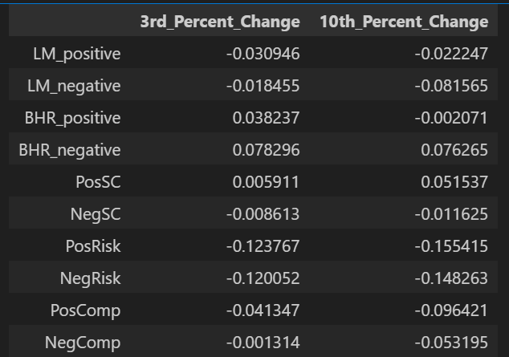
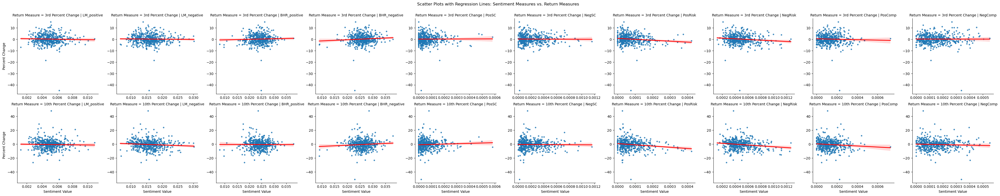

---
layout: wide_default
---  

## Evan Trock's Report for The Midterm

# Summary Section
The goal of this program was to look at companies in the S&P 500, measure the sentiment of the each companies' 10k and look at the returns after the 10k's were filed. The ending results were a correlation table, showing the strength of the connection between the sentiment and the return, and different scatterplots to measure each given measure.

Another part of this program was to create different sentiment topics, the one's I chose to use were Supply Chain, Risk and Competition. I was able to measure how each of these specific topics and the way they were talked about in the 10k affected the return of the stock. My findings were slightly disappointing as I did not find an overly large effect on the stock prices both 3 days after and 10 days after filing.

# Data Section

## Sample Description
The dataset consists of companies in the S&P 500 index. For each company, the analysis focuses on their 10-K filings, measuring sentiment and examining the returns following the filing dates. The final dataset includes variables for sentiment, returns, and contextual sentiment topics.

## Return Variables
The return variables are constructed as follows:
1. **Raw Returns**: Calculated as the percentage change in stock price from the day before the 10-K filing to a specified number of days after the filing.
    - Formula: Percent Change: (Stock Price(t=10 or 3)- Stock Price(file date))/Stock Price(file date)

## Sentiment Variables
The sentiment variables are built using textual analysis of the 10-K filings:
1. **Positive and Negative Sentiment**:
    - Count the occurrences of words from predefined dictionaries (e.g., LM and ML dictionaries).
    - Normalize by the total word count in the document.
    - Formula: \( \text{Sentiment Score} = \frac{\text{Word Count (Positive/Negative)}}{\text{Total Word Count}} \)
2. **Contextual Sentiment**:
    - Use the `near_regex` function to identify sentiment words in the context of specific topics (e.g., Supply Chain, Risk, Competition).
    - Parameters: `partial=True`, `distance=5` (words within a 5-word window are considered relevant).

### Dictionary Word Counts
- LM Positive Dictionary: 347
- LM Negative Dictionary: 2347
- ML Positive Dictionary: 75
- ML Negative Dictionary: 94

## Near_Regex Function Setup
- **Partial**: Set to `True` to allow partial matches for flexibility.
- **Distance**: Set to `5` to capture sentiment within a reasonable context window.
- **Rationale**: These values balance precision and recall, ensuring relevant sentiment is captured without excessive noise.

## Contextual Sentiment Topics
1. **Supply Chain**: Critical for understanding operational challenges.
2. **Risk**: Central to assessing uncertainty and volatility.
3. **Competition**: Key for evaluating market positioning and strategy.

## Smell Tests
Initial Hypothesis: A higher sentiment score in the positive direction will result in a slight improvement, but a negative score would hurt the stock much more than a positive score would help. Depending on the sector, supply chain scores could be very important or not as well.

## Caveats
- **Sample Bias**: The dataset is limited to S&P 500 companies, which may not generalize to smaller firms.
- **Analysis Limitations**: Contextual sentiment measures rely on dictionary-based methods, which may miss nuanced language.

These considerations provide the necessary context for interpreting the results and understanding the dataset.

# Results

Correlation Table: 

Regression Plots:

Discussion Topics:

1. The variable that was affected in the way one would expect was Supply chain, as there was a positive correlation with return for the positive words, and negative for the negative words. The risk topic was about the same for both positive and negative words, and the competition topic was flipped. I think most of this is because of a couple of outliers. I will say that the 3 day and 10 day returns were interesting, as the effect for each topic was only exacerbated by the time period.

2. Sample size could have been a differentiating factor:
Table 3 in the paper uses 76,922 10-K filings over a wide time span (1995–2018) and includes 10,076 unique firms.
There also could have been changes made to the ML and or LM dictionaries, changing the way words were scored.
There was definitely something off with the results that I ended up with as my correlations are completely different.

3. I think that the supply chain topic's data is stand-alone and shows correlation, but the other two should have some of its words perhaps reconsidered. Maybe the risk should not be further investigated, but the supply chain and competition topics yielded interesting results.
Supply Chain: For almost all companies excluding service companies, supply chain is a very important aspect of operations. There are not many numbers that can measure it outside of inventory, so the sentiment surrounding the topic is incredibly important
Competition: Companies will not talk about their direct competitors in a 10k, but the sentiment surrounding the topic is very telling about a given companies place in their market.  

4. Looking at the results, there are some interesting differences in both the direction and strength of the relationships between sentiment and stock returns. For example, the LM_positive sentiment score shows a negative effect on returns, which is the opposite of what we’d normally expect—though it's not statistically significant, so it might just be noise. LM_negative performs more as expected, with a negative coefficient that's borderline significant. What really stands out is the BHR_negative sentiment, which surprisingly shows a strong and statistically significant positive effect on returns. That’s not what we’d usually predict and might suggest that in the sample, negative language was interpreted as honesty or caution—something investors may have appreciated. These mixed results could be due to a smaller dataset, missing control variables, or differences in how sentiment was measured or when returns were captured.
