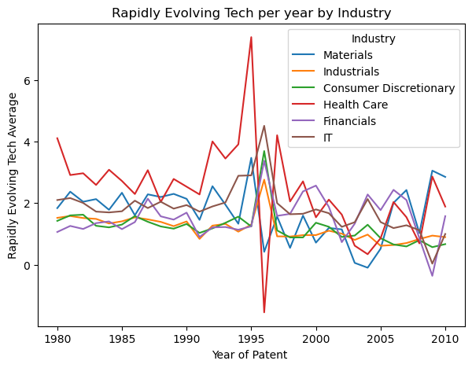
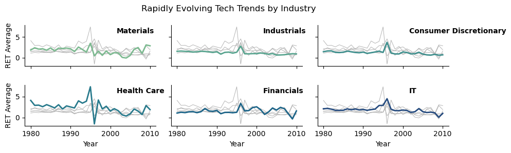

# Assignment 4: Merging

This assignment requires you to 
- Explore some new data on patents
- Implement merges according to [best practices](https://ledatascifi.github.io/ledatascifi-2024/content/03/05b_merging.html#merging-in-new-variables-to-your-analysis)
- I did not include questions explicitly aimed at [Merging in new variables to your analysis](https://ledatascifi.github.io/ledatascifi-2024/content/03/05b_merging.html#merging-in-new-variables-to-your-analysis) or [Create your variables before a merge when possible](https://ledatascifi.github.io/ledatascifi-2024/content/03/05b_merging.html#create-your-variables-before-a-merge-when-possible), but **you should read those** because they will matter for the midterm project and your group projects a lot!
  - I removed questions on these topics to lighten the assignment burden, but don't infer a lack of import: These are very important skills!


```python
import pandas as pd
import numpy as np
import matplotlib.pyplot as plt
import pandas_datareader as pdr
import seaborn as sns

# these three are used to open the CCM dataset:
from io import BytesIO
from zipfile import ZipFile
from urllib.request import urlopen
```

## Download CCM data

This code comes from the textbook.

To get the URL, I [went to the data repo and found it](https://github.com/LeDataSciFi/data/blob/main/Firm%20Year%20Datasets%20(Compustat)/CCM_cleaned_for_class.zip), and then I right clicked on the "Download" button and copied the link. 


```python
url = 'https://github.com/LeDataSciFi/ledatascifi-2025/blob/main/data/CCM_cleaned_for_class.zip?raw=true'

#ccm = pd.read_stata(url)   
# <-- that code would work if I had uploaded the data as a csv file, but GH said it was too big to upload 
# so I zipped it. We need a little workaround to download it:

with urlopen(url) as request:
    data = BytesIO(request.read())

with ZipFile(data) as archive:
    with archive.open(archive.namelist()[0]) as stata:
        ccm = pd.read_stata(stata)
```

## Firm year patent data.

We will use `firmyear_patstats.csv`. It's in the same place in the data repo as the CCM file. You will figure out how to download it _by script._ Don't download the file to your computer.  

It contains variables that we want to include in the  CCM dataset for analysis.


```python
url = "https://raw.githubusercontent.com/LeDataSciFi/data/main/Firm%20Year%20Datasets%20(Compustat)/firmyear_patstats.csv"

firmyear_patstats = pd.read_csv(url)

```


```python
ccm
```


<div>
<style scoped>
    .dataframe tbody tr th:only-of-type {
        vertical-align: middle;
    }

    .dataframe tbody tr th {
        vertical-align: top;
    }

    .dataframe thead th {
        text-align: right;
    }
</style>
<table border="1" class="dataframe">
  <thead>
    <tr style="text-align: right;">
      <th></th>
      <th>gvkey</th>
      <th>fyear</th>
      <th>datadate</th>
      <th>lpermno</th>
      <th>gsector</th>
      <th>sic</th>
      <th>sic3</th>
      <th>age</th>
      <th>tic</th>
      <th>state</th>
      <th>...</th>
      <th>tnic3hhi</th>
      <th>tnic3tsimm</th>
      <th>prodmktfluid</th>
      <th>delaycon</th>
      <th>equitydelaycon</th>
      <th>debtdelaycon</th>
      <th>privdelaycon</th>
      <th>l_emp</th>
      <th>l_ppent</th>
      <th>l_laborratio</th>
    </tr>
  </thead>
  <tbody>
    <tr>
      <th>0</th>
      <td>1000</td>
      <td>1975.0</td>
      <td>1975-12-31</td>
      <td>25881.0</td>
      <td></td>
      <td>3089.0</td>
      <td>308.0</td>
      <td>0.0</td>
      <td>AE.2</td>
      <td></td>
      <td>...</td>
      <td>NaN</td>
      <td>NaN</td>
      <td>NaN</td>
      <td>NaN</td>
      <td>NaN</td>
      <td>NaN</td>
      <td>NaN</td>
      <td>0.719789</td>
      <td>2.111788</td>
      <td>1.930200</td>
    </tr>
    <tr>
      <th>1</th>
      <td>1000</td>
      <td>1976.0</td>
      <td>1976-12-31</td>
      <td>25881.0</td>
      <td></td>
      <td>3089.0</td>
      <td>308.0</td>
      <td>1.0</td>
      <td>AE.2</td>
      <td></td>
      <td>...</td>
      <td>NaN</td>
      <td>NaN</td>
      <td>NaN</td>
      <td>NaN</td>
      <td>NaN</td>
      <td>NaN</td>
      <td>NaN</td>
      <td>0.900161</td>
      <td>2.858766</td>
      <td>2.421281</td>
    </tr>
    <tr>
      <th>2</th>
      <td>1000</td>
      <td>1977.0</td>
      <td>1977-12-31</td>
      <td>25881.0</td>
      <td></td>
      <td>3089.0</td>
      <td>308.0</td>
      <td>2.0</td>
      <td>AE.2</td>
      <td></td>
      <td>...</td>
      <td>NaN</td>
      <td>NaN</td>
      <td>NaN</td>
      <td>NaN</td>
      <td>NaN</td>
      <td>NaN</td>
      <td>NaN</td>
      <td>1.008323</td>
      <td>3.040562</td>
      <td>2.437114</td>
    </tr>
    <tr>
      <th>3</th>
      <td>1001</td>
      <td>1983.0</td>
      <td>1983-12-31</td>
      <td>10015.0</td>
      <td>25</td>
      <td>5812.0</td>
      <td>581.0</td>
      <td>0.0</td>
      <td>AMFD.</td>
      <td>OK</td>
      <td>...</td>
      <td>NaN</td>
      <td>NaN</td>
      <td>NaN</td>
      <td>NaN</td>
      <td>NaN</td>
      <td>NaN</td>
      <td>NaN</td>
      <td>0.869618</td>
      <td>2.255074</td>
      <td>1.817871</td>
    </tr>
    <tr>
      <th>4</th>
      <td>1001</td>
      <td>1984.0</td>
      <td>1984-12-31</td>
      <td>10015.0</td>
      <td>25</td>
      <td>5812.0</td>
      <td>581.0</td>
      <td>1.0</td>
      <td>AMFD.</td>
      <td>OK</td>
      <td>...</td>
      <td>NaN</td>
      <td>NaN</td>
      <td>NaN</td>
      <td>NaN</td>
      <td>NaN</td>
      <td>NaN</td>
      <td>NaN</td>
      <td>0.917090</td>
      <td>2.618490</td>
      <td>2.135985</td>
    </tr>
    <tr>
      <th>...</th>
      <td>...</td>
      <td>...</td>
      <td>...</td>
      <td>...</td>
      <td>...</td>
      <td>...</td>
      <td>...</td>
      <td>...</td>
      <td>...</td>
      <td>...</td>
      <td>...</td>
      <td>...</td>
      <td>...</td>
      <td>...</td>
      <td>...</td>
      <td>...</td>
      <td>...</td>
      <td>...</td>
      <td>...</td>
      <td>...</td>
      <td>...</td>
    </tr>
    <tr>
      <th>222996</th>
      <td>297209</td>
      <td>2012.0</td>
      <td>2012-12-31</td>
      <td>13104.0</td>
      <td>10</td>
      <td>1381.0</td>
      <td>138.0</td>
      <td>1.0</td>
      <td>PACD</td>
      <td></td>
      <td>...</td>
      <td>NaN</td>
      <td>NaN</td>
      <td>NaN</td>
      <td>NaN</td>
      <td>NaN</td>
      <td>NaN</td>
      <td>NaN</td>
      <td>0.471877</td>
      <td>8.232553</td>
      <td>8.738124</td>
    </tr>
    <tr>
      <th>222997</th>
      <td>297209</td>
      <td>2013.0</td>
      <td>2013-12-31</td>
      <td>13104.0</td>
      <td>10</td>
      <td>1381.0</td>
      <td>138.0</td>
      <td>2.0</td>
      <td>PACD</td>
      <td></td>
      <td>...</td>
      <td>NaN</td>
      <td>NaN</td>
      <td>NaN</td>
      <td>NaN</td>
      <td>NaN</td>
      <td>NaN</td>
      <td>NaN</td>
      <td>0.663718</td>
      <td>8.414751</td>
      <td>8.474280</td>
    </tr>
    <tr>
      <th>222998</th>
      <td>311524</td>
      <td>2013.0</td>
      <td>2013-12-31</td>
      <td>13861.0</td>
      <td>15</td>
      <td>2860.0</td>
      <td>286.0</td>
      <td>0.0</td>
      <td>TAM</td>
      <td>PA</td>
      <td>...</td>
      <td>0.326118</td>
      <td>1.1371</td>
      <td>5.650078</td>
      <td>NaN</td>
      <td>NaN</td>
      <td>NaN</td>
      <td>NaN</td>
      <td>0.615726</td>
      <td>6.154858</td>
      <td>6.314076</td>
    </tr>
    <tr>
      <th>222999</th>
      <td>315887</td>
      <td>2013.0</td>
      <td>2013-12-31</td>
      <td>14344.0</td>
      <td>20</td>
      <td>4412.0</td>
      <td>441.0</td>
      <td>0.0</td>
      <td>SALT</td>
      <td></td>
      <td>...</td>
      <td>NaN</td>
      <td>NaN</td>
      <td>NaN</td>
      <td>NaN</td>
      <td>NaN</td>
      <td>NaN</td>
      <td>NaN</td>
      <td>0.001000</td>
      <td>5.920753</td>
      <td>12.825821</td>
    </tr>
    <tr>
      <th>223000</th>
      <td>316056</td>
      <td>2013.0</td>
      <td>2013-12-31</td>
      <td>14297.0</td>
      <td>20</td>
      <td>3420.0</td>
      <td>342.0</td>
      <td>0.0</td>
      <td>ALLE</td>
      <td></td>
      <td>...</td>
      <td>0.554508</td>
      <td>1.0259</td>
      <td>1.421064</td>
      <td>NaN</td>
      <td>NaN</td>
      <td>NaN</td>
      <td>NaN</td>
      <td>2.197225</td>
      <td>5.318120</td>
      <td>3.233764</td>
    </tr>
  </tbody>
</table>
<p>223001 rows × 43 columns</p>
</div>


```python
firmyear_patstats
```


<div>
<style scoped>
    .dataframe tbody tr th:only-of-type {
        vertical-align: middle;
    }

    .dataframe tbody tr th {
        vertical-align: top;
    }

    .dataframe thead th {
        text-align: right;
    }
</style>
<table border="1" class="dataframe">
  <thead>
    <tr style="text-align: right;">
      <th></th>
      <th>gvkey</th>
      <th>ayear</th>
      <th>patent_app_count</th>
      <th>RETech_avg</th>
    </tr>
  </thead>
  <tbody>
    <tr>
      <th>0</th>
      <td>1000</td>
      <td>1974</td>
      <td>2</td>
      <td>1.282584</td>
    </tr>
    <tr>
      <th>1</th>
      <td>1000</td>
      <td>1975</td>
      <td>2</td>
      <td>1.309539</td>
    </tr>
    <tr>
      <th>2</th>
      <td>1000</td>
      <td>1976</td>
      <td>2</td>
      <td>1.099830</td>
    </tr>
    <tr>
      <th>3</th>
      <td>1004</td>
      <td>1979</td>
      <td>1</td>
      <td>0.462650</td>
    </tr>
    <tr>
      <th>4</th>
      <td>1004</td>
      <td>1981</td>
      <td>1</td>
      <td>2.276393</td>
    </tr>
    <tr>
      <th>...</th>
      <td>...</td>
      <td>...</td>
      <td>...</td>
      <td>...</td>
    </tr>
    <tr>
      <th>86375</th>
      <td>311524</td>
      <td>2009</td>
      <td>1</td>
      <td>4.002895</td>
    </tr>
    <tr>
      <th>86376</th>
      <td>318728</td>
      <td>2015</td>
      <td>1</td>
      <td>1.407193</td>
    </tr>
    <tr>
      <th>86377</th>
      <td>318728</td>
      <td>2016</td>
      <td>2</td>
      <td>1.995176</td>
    </tr>
    <tr>
      <th>86378</th>
      <td>332115</td>
      <td>2000</td>
      <td>1</td>
      <td>1.765147</td>
    </tr>
    <tr>
      <th>86379</th>
      <td>349530</td>
      <td>2017</td>
      <td>1</td>
      <td>0.521259</td>
    </tr>
  </tbody>
</table>
<p>86380 rows × 4 columns</p>
</div>


## PART 1

Insert cell(s) below this one as needed to finish this Part.

Use the two datasets above to answer the following questions. Assume for these questions that the `ccm` data is the "left" dataset and the `firmyear_patstats` is the "right" dataset. 

1. How many observations are there in `ccm` data?
2. How many observations are there in `firmyear_patstats` data?
3. After an inner merge?
4. How many observations are there after a left merge?
5. After a right merge? 
6. After an outer merge? 
7. Why isn't the answer to Q4 and Q5 the same?
8. Is this a 1:1, 1:M, M:1, or M:M merge?

Remember: Specify `how`, `on`, `indicator=True`, and `validate` on each merge!


```python
print('1. ccm: ', len(ccm))
print('2. firmyear_patstats: ', len(firmyear_patstats))
inner = ccm.merge(firmyear_patstats, left_on=["gvkey", "fyear"], right_on=["gvkey", "ayear"], how = 'inner', indicator = True, validate = '1:1')
print('3. Inner: ', len(inner))
left = ccm.merge(firmyear_patstats, left_on=["gvkey", "fyear"], right_on=["gvkey", "ayear"], how = 'left', indicator = True, validate = '1:1')
print('4. Left: ', len(left))
right = ccm.merge(firmyear_patstats, left_on=["gvkey", "fyear"], right_on=["gvkey", "ayear"], how = 'right', indicator = True, validate = '1:1')
print('5. Right: ', len(right))
outer = ccm.merge(firmyear_patstats, left_on=["gvkey", "fyear"], right_on=["gvkey", "ayear"], how = 'outer', indicator = True, validate = '1:1')
print('6. Outer: ', len(outer))
print('7. They are different because the left data frame and right data frame have different numbers of gvkeys, ccm is on the left and has more so the right merge results in a smaller number.')
print('8. This is a 1:1 Merge')
```

    1. ccm:  223001
    2. firmyear_patstats:  86380
    3. Inner:  49130
    4. Left:  223001
    5. Right:  86380
    6. Outer:  260251
    7. They are different because the left data frame and right data frame have different numbers of gvkeys, ccm is on the left and has more so the right merge results in a smaller number.
    8. This is a 1:1 Merge
    

## Part 2: Industry patenting trends

- Reduce the data to gsectors 15, 35, 20, 45, 40, 25, and years 1980-2010.
- Calculate the average **patent-level** RETech across **patents (not firm years)** for each industry-year 
    - Gsector 15 will have a value for 1980, and 1981, Gsector 35 will have a value for 1980, and 1981, and so on...
    - **Be thoughtful about how you compute this from the firmyear_patstats df.** There is a correct answer. Don't ask questions about this on the discussion board. 
    - Hint: Solve this on paper with a tiny fictional dataset of patents. Think about how this dataset would be represented in the `firmyear_patstats` data. How do you answer it from that dataset?
- Q9. Print out the year 2000 industry averages you just computed. This is a checkpoint for grading.
- Q10. Plot the time-trends of the industry averages 
    - 2%: Set the title, xlabel, and ylabel
    - 2%: There should be no error bands showing
    - 4%: Replace the gsector numbers with the names of the industries
    - 3% of the total grade of the assignment will be reserved for implementing [the "sparkline" style of graph ](https://github.com/LeDataSciFi/ledatascifi-2024/discussions/15#discussioncomment-8548094) several students made for Assignment 3.
        - Because of how I chose to structure the data, I had to alter the code linked above to use hue instead of units, and [then correct the background line colors](https://stackoverflow.com/questions/67221399/plotting-multiple-lines-with-same-color-but-using-hue-to-separate-the-lines).
        - It's possible my tweaks can be avoided. 


```python
#Q:9
selected_gsectors = [15, 35, 20, 45, 40, 25]
filtered= outer[
    (outer["gsector"].isin(map(str, selected_gsectors))) &
    (outer["fyear"].between(1980, 2010)) 
]

final = filtered.groupby(['gsector','fyear'],as_index=False).apply(
    lambda x:(x['RETech_avg']* x['patent_app_count']).sum() / x['patent_app_count'].sum())

final =final.rename(columns ={ None: 'retech_total'})
```

    C:\Users\Sport\AppData\Local\Temp\ipykernel_36652\894074114.py:8: DeprecationWarning: DataFrameGroupBy.apply operated on the grouping columns. This behavior is deprecated, and in a future version of pandas the grouping columns will be excluded from the operation. Either pass `include_groups=False` to exclude the groupings or explicitly select the grouping columns after groupby to silence this warning.
      final = filtered.groupby(['gsector','fyear'],as_index=False).apply(
    


```python
final_2000 = final[final["fyear"] == 2000]
print('Q9:' ,final_2000)
```

    Q9:     gsector   fyear  retech_total
    20       15  2000.0      0.718465
    51       20  2000.0      0.963049
    82       25  2000.0      1.364302
    113      35  2000.0      1.540477
    144      40  2000.0      2.570576
    175      45  2000.0      1.796434
    


```python
print('Question 10 Lineplot:')
final["gsector"] = final["gsector"].astype(int)

industry_names = {
    15: "Materials",
    35: "Health Care",
    20: "Industrials",
    45: "IT",
    40: "Financials",
    25: "Consumer Discretionary"
}
final["Industry"] = final["gsector"].map(industry_names)
#print(final.head(10))
fig, ax = plt.subplots(figsize = ( 7 , 5 )) 
sns.lineplot(data = final, ax = ax,  x = 'fyear', y = 'retech_total', hue="Industry", ).set(
    xlabel = 'Year of Patent ', ylabel = 'Rapidly Evolving Tech Average', title = 'Rapidly Evolving Tech per year by Industry')
#ax.legend(title = "Inudstry",) 

plt.show()
```

    Question 10 Lineplot:
    


    

    


```python
print('Question 10 Sparkplots:')
g = sns.relplot(
    data=final,
    x="fyear", y="retech_total", col="Industry", hue="Industry",
    kind="line", palette="crest", linewidth=2, zorder=5,
    col_wrap=3, height=1.5, aspect=2, legend=False 
)

# Iterate over each subplot to customize further
for industry, ax in g.axes_dict.items():

    # Add title inside as an annotation with the plot
    ax.text(.7, .8, industry, transform=ax.transAxes, fontweight="bold")

    # Plot every year's time series in the background
    sns.lineplot(
        data=final, x="fyear", y="retech_total", units="Industry",
        estimator=None, color=".7", linewidth=0.7, ax=ax,
    )
ax.set_xlabel("")
ax.set_ylabel("")

# Tweak the supporting aspects of the plot
g.set_titles("")
g.set_axis_labels("Year", "RET Average")
g.fig.suptitle("Rapidly Evolving Tech Trends by Industry", fontsize=12)
g.fig.subplots_adjust(top=0.85)

plt.show()

```

    Question 10 Sparkplots:
    


    

    


## Part 3: Outliers

Below, I've provided code that uses the  dataframe for Part 2. I called that dataframe `subsample`. I have a variable in it called `RETech_avg`. I then winsorize the RETech variable two ways: (a) over the whole sample, and (b) separately within each year. 

If your dataframe is the same as mine, the code below should run.  You might need to install `statsmodels` first. 

Run the code, and consider the two outputs:
1. The first output is a table of correlations between RETech and R&D. 
2. The second output shows those correlations, but adjusted for industry factors and time trends. (We will talk about regressions after the break. For now, just consider these as "industry-adjusted correlations" and it will suffice.)

Even though the second approach is much more statistically robust, both of these show the same pattern: The original variable has the weakest correlation with R&D, and one of the two winsorizations show the strongest relationship. 

After you look at the results, I'll ask the questions below...


```python
import statsmodels.formula.api as smf
import statsmodels.api as sm

def winsorizer_with_missing(df,low_=.01,hi_=.99,cols=None): 
    # asset that columns is passed
    assert cols is not None, "Please pass a list of columns to winsorize"
        
    df[cols] = df[cols].clip(lower=df[cols].quantile(low_),
                             upper=df[cols].quantile(hi_),
                             axis=1)
    return df

subsample= filtered.copy()

# create new variables to store different versions of winsorized RETech (the function overwrites the original)
subsample['RETech_avg_winsorizeAll'] = subsample['RETech_avg']
subsample['RETech_avg_winsorizeByYear'] = subsample['RETech_avg']
subsample = subsample.rename(columns={'RETech_avg':'RETech_avg_orig'})

# winsorize over the whole sample
subsample = winsorizer_with_missing(subsample,cols=['RETech_avg_winsorizeAll'])

# winsorize by year
subsample = subsample.groupby('fyear').apply(winsorizer_with_missing,cols=['RETech_avg_winsorizeByYear'])
```

    C:\Users\Sport\AppData\Local\Temp\ipykernel_36652\2771249271.py:24: DeprecationWarning: DataFrameGroupBy.apply operated on the grouping columns. This behavior is deprecated, and in a future version of pandas the grouping columns will be excluded from the operation. Either pass `include_groups=False` to exclude the groupings or explicitly select the grouping columns after groupby to silence this warning.
      subsample = subsample.groupby('fyear').apply(winsorizer_with_missing,cols=['RETech_avg_winsorizeByYear'])
    


```python
# compare the winsorized versions to R&D via correlation
(
subsample[['RETech_avg_orig','RETech_avg_winsorizeAll','RETech_avg_winsorizeByYear','xrd_a','patent_app_count']]
.corr()
.style.background_gradient(cmap='coolwarm') # ooooh fancy
)
```


<style type="text/css">
#T_54d06_row0_col0, #T_54d06_row1_col1, #T_54d06_row2_col2, #T_54d06_row3_col3, #T_54d06_row4_col4 {
  background-color: #b40426;
  color: #f1f1f1;
}
#T_54d06_row0_col1, #T_54d06_row1_col0 {
  background-color: #d44e41;
  color: #f1f1f1;
}
#T_54d06_row0_col2, #T_54d06_row2_col0 {
  background-color: #d0473d;
  color: #f1f1f1;
}
#T_54d06_row0_col3 {
  background-color: #7a9df8;
  color: #f1f1f1;
}
#T_54d06_row0_col4, #T_54d06_row1_col4 {
  background-color: #4257c9;
  color: #f1f1f1;
}
#T_54d06_row1_col2, #T_54d06_row2_col1 {
  background-color: #be242e;
  color: #f1f1f1;
}
#T_54d06_row1_col3 {
  background-color: #82a6fb;
  color: #f1f1f1;
}
#T_54d06_row2_col3 {
  background-color: #7da0f9;
  color: #f1f1f1;
}
#T_54d06_row2_col4 {
  background-color: #4358cb;
  color: #f1f1f1;
}
#T_54d06_row3_col0 {
  background-color: #7396f5;
  color: #f1f1f1;
}
#T_54d06_row3_col1 {
  background-color: #7b9ff9;
  color: #f1f1f1;
}
#T_54d06_row3_col2 {
  background-color: #7597f6;
  color: #f1f1f1;
}
#T_54d06_row3_col4, #T_54d06_row4_col0, #T_54d06_row4_col1, #T_54d06_row4_col2, #T_54d06_row4_col3 {
  background-color: #3b4cc0;
  color: #f1f1f1;
}
</style>
<table id="T_54d06">
  <thead>
    <tr>
      <th class="blank level0" >&nbsp;</th>
      <th id="T_54d06_level0_col0" class="col_heading level0 col0" >RETech_avg_orig</th>
      <th id="T_54d06_level0_col1" class="col_heading level0 col1" >RETech_avg_winsorizeAll</th>
      <th id="T_54d06_level0_col2" class="col_heading level0 col2" >RETech_avg_winsorizeByYear</th>
      <th id="T_54d06_level0_col3" class="col_heading level0 col3" >xrd_a</th>
      <th id="T_54d06_level0_col4" class="col_heading level0 col4" >patent_app_count</th>
    </tr>
  </thead>
  <tbody>
    <tr>
      <th id="T_54d06_level0_row0" class="row_heading level0 row0" >RETech_avg_orig</th>
      <td id="T_54d06_row0_col0" class="data row0 col0" >1.000000</td>
      <td id="T_54d06_row0_col1" class="data row0 col1" >0.908166</td>
      <td id="T_54d06_row0_col2" class="data row0 col2" >0.921003</td>
      <td id="T_54d06_row0_col3" class="data row0 col3" >0.172418</td>
      <td id="T_54d06_row0_col4" class="data row0 col4" >-0.004941</td>
    </tr>
    <tr>
      <th id="T_54d06_level0_row1" class="row_heading level0 row1" >RETech_avg_winsorizeAll</th>
      <td id="T_54d06_row1_col0" class="data row1 col0" >0.908166</td>
      <td id="T_54d06_row1_col1" class="data row1 col1" >1.000000</td>
      <td id="T_54d06_row1_col2" class="data row1 col2" >0.972023</td>
      <td id="T_54d06_row1_col3" class="data row1 col3" >0.199039</td>
      <td id="T_54d06_row1_col4" class="data row1 col4" >-0.002802</td>
    </tr>
    <tr>
      <th id="T_54d06_level0_row2" class="row_heading level0 row2" >RETech_avg_winsorizeByYear</th>
      <td id="T_54d06_row2_col0" class="data row2 col0" >0.921003</td>
      <td id="T_54d06_row2_col1" class="data row2 col1" >0.972023</td>
      <td id="T_54d06_row2_col2" class="data row2 col2" >1.000000</td>
      <td id="T_54d06_row2_col3" class="data row2 col3" >0.180725</td>
      <td id="T_54d06_row2_col4" class="data row2 col4" >-0.001181</td>
    </tr>
    <tr>
      <th id="T_54d06_level0_row3" class="row_heading level0 row3" >xrd_a</th>
      <td id="T_54d06_row3_col0" class="data row3 col0" >0.172418</td>
      <td id="T_54d06_row3_col1" class="data row3 col1" >0.199039</td>
      <td id="T_54d06_row3_col2" class="data row3 col2" >0.180725</td>
      <td id="T_54d06_row3_col3" class="data row3 col3" >1.000000</td>
      <td id="T_54d06_row3_col4" class="data row3 col4" >-0.029515</td>
    </tr>
    <tr>
      <th id="T_54d06_level0_row4" class="row_heading level0 row4" >patent_app_count</th>
      <td id="T_54d06_row4_col0" class="data row4 col0" >-0.004941</td>
      <td id="T_54d06_row4_col1" class="data row4 col1" >-0.002802</td>
      <td id="T_54d06_row4_col2" class="data row4 col2" >-0.001181</td>
      <td id="T_54d06_row4_col3" class="data row4 col3" >-0.029515</td>
      <td id="T_54d06_row4_col4" class="data row4 col4" >1.000000</td>
    </tr>
  </tbody>
</table>


```python
# compare the two alts to R&D via regression with industry and year fixed effects

regressions = [
    # these tuples are (regression formula, title)
    (smf.ols('xrd_a ~ RETech_avg_orig            + np.log(patent_app_count) + C(fyear) + C(gsector)', data=subsample).fit(), 'R&D'),
    (smf.ols('xrd_a ~ RETech_avg_winsorizeAll    + np.log(patent_app_count) + C(fyear) + C(gsector)', data=subsample).fit(), 'R&D'),
    (smf.ols('xrd_a ~ RETech_avg_winsorizeByYear + np.log(patent_app_count) + C(fyear) + C(gsector)', data=subsample).fit(), 'R&D')
]

fixed_effects_name_to_label = {'Year FE': 'fyear', 
                               'Industry FE': 'gsector'}

def reg_table_with_FE(regressions, fe_label_info):
    ''' 
    This function generates a regression table with fixed effects, but hides
    the fixed effects from the table.
    
    Parameters
    ----------
    regressions : list of tuples, each tuple is (regression, title) where
        regression is a fitted statsmodels regression and title is a string
    info_dict : dict, keys are strings that will be displayed in the table
    '''
    import statsmodels.formula.api as smf
    from statsmodels.iolib.summary2 import summary_col

    # Define the factory function for fixed effects
    def make_has_FE(fixed_effect):
        def has_FE(x):
            cat_vars = any(param.startswith(f'C({fixed_effect})') for param in x.params.index)
            return "Yes" if cat_vars else ""
        return has_FE
        
    # Info dict to be used in the summary
    info_dict = {k:make_has_FE(v) for k,v in fe_label_info.items()}
    
    # Getting the summary statistics for the regressions
    summary = summary_col([reg[0] for reg in regressions],
                        model_names=[f'{i}. '+reg[1] for i, reg in enumerate(regressions, 1)],
                        info_dict=info_dict,
                        )

    # # Summary Cleaning 
    df = summary.tables[0]
    index_series = pd.Series(df.index, index=df.index)
    skip_flag = index_series.apply(lambda x: x.startswith('C('))
    skip_next_flag = skip_flag.shift(fill_value=False)
    final_skip = skip_flag | skip_next_flag
    df_filtered = df[~final_skip]
    df_filtered

    # Set r^2 to the bottom
    r_squared_rows = df_filtered.index[df_filtered.index.str.contains('R-squared')]
    df_r_squared = df_filtered.loc[r_squared_rows]
    df_filtered = df_filtered.drop(r_squared_rows)
    df_filtered = pd.concat([df_filtered, df_r_squared])
    return df_filtered

reg_table_with_FE(regressions, fixed_effects_name_to_label)

```


<div>
<style scoped>
    .dataframe tbody tr th:only-of-type {
        vertical-align: middle;
    }

    .dataframe tbody tr th {
        vertical-align: top;
    }

    .dataframe thead th {
        text-align: right;
    }
</style>
<table border="1" class="dataframe">
  <thead>
    <tr style="text-align: right;">
      <th></th>
      <th>1. R&amp;D</th>
      <th>2. R&amp;D</th>
      <th>3. R&amp;D</th>
    </tr>
  </thead>
  <tbody>
    <tr>
      <th>Intercept</th>
      <td>-0.0079</td>
      <td>-0.0143</td>
      <td>-0.0113</td>
    </tr>
    <tr>
      <th></th>
      <td>(0.0071)</td>
      <td>(0.0071)</td>
      <td>(0.0071)</td>
    </tr>
    <tr>
      <th>RETech_avg_orig</th>
      <td>0.0095</td>
      <td></td>
      <td></td>
    </tr>
    <tr>
      <th></th>
      <td>(0.0004)</td>
      <td></td>
      <td></td>
    </tr>
    <tr>
      <th>np.log(patent_app_count)</th>
      <td>-0.0059</td>
      <td>-0.0063</td>
      <td>-0.0062</td>
    </tr>
    <tr>
      <th></th>
      <td>(0.0006)</td>
      <td>(0.0006)</td>
      <td>(0.0006)</td>
    </tr>
    <tr>
      <th>RETech_avg_winsorizeAll</th>
      <td></td>
      <td>0.0149</td>
      <td></td>
    </tr>
    <tr>
      <th></th>
      <td></td>
      <td>(0.0006)</td>
      <td></td>
    </tr>
    <tr>
      <th>RETech_avg_winsorizeByYear</th>
      <td></td>
      <td></td>
      <td>0.0126</td>
    </tr>
    <tr>
      <th></th>
      <td></td>
      <td></td>
      <td>(0.0005)</td>
    </tr>
    <tr>
      <th>Industry FE</th>
      <td>Yes</td>
      <td>Yes</td>
      <td>Yes</td>
    </tr>
    <tr>
      <th>Year FE</th>
      <td>Yes</td>
      <td>Yes</td>
      <td>Yes</td>
    </tr>
    <tr>
      <th>R-squared</th>
      <td>0.1702</td>
      <td>0.1744</td>
      <td>0.1717</td>
    </tr>
    <tr>
      <th>R-squared Adj.</th>
      <td>0.1693</td>
      <td>0.1736</td>
      <td>0.1708</td>
    </tr>
  </tbody>
</table>
</div>


### Some questions based on these results

- A: We see that winsorizing strengthens the correlation with R&D compared to the raw data. What does this suggest about the nature of the outliers in our RETech variable? What might these outliers represent in terms of real business contexts?
- B: Why might winsorizing within each year produce different results than winsorizing across the entire sample? Think about how technology adoption patterns might change over time.
- C: When we adjust for industry factors via regressions, the pattern of correlations remains similar but the magnitudes change. What does this tell us about the robustness of the relationship between RETech and R&D spending?
- D: In what scenarios might you prefer year-by-year winsorization over full-sample winsorization? Speculate.

### Answers for A-C

(Yes, you're seeing these now! This Q&A isn't for assessment, it's demonstration and lecture, because I can usually count on your attention being sharp on the assignments!)

- A:  The strengthened correlation after winsorization suggests that the outliers were negatively correlated with R&D compared to the rest of the data. By reducing the importance of these observations, the correlation went up. Perhaps these outliers were noise, measurement error, or driven by different economic processes. E.g., these outliers might represent one-time technology implementations that don't reflect the typical relationship between technology adoption and R&D investment.
- B: Year-by-year winsorization produces different results because technology adoption patterns and norms evolve over time. What might be considered an "extreme" value in 2000 could be relatively normal in 2020 due to technological progress and changing business practices. Full-sample winsorization applies the same thresholds across all years, potentially over-adjusting values in later years when higher technology adoption becomes more common, or under-adjusting values in earlier years when technology adoption was generally lower. Year-by-year winsorization respects the temporal context of the observations.
- C: The fact that the pattern of correlations remains similar after adjusting for industry factors (and time! and patenting amounts!) suggests that the relationship between RETech and R&D is robust and not merely driven by industry-specific effects. This strengthens our confidence in the underlying relationship - it exists both within and across industries. The change in magnitudes after industry adjustment indicates that some of the raw correlation was indeed due to industry effects, but the core relationship persists even after controlling for these factors.

### Answer for D:

Write your answer to D below.


As stated before, if there is a lot of changes in technology in the sector, year by year may be better as it gets rid outliers that may be extreme one year, and normal in another. It also adapts bettter to economic cycles like recessions or more often like inflation. It really works the best when both of these are the case, as well as having a large data set. 

## Bonus: Ungraded, hard perhaps, but useful on the next assignment/midterm

On the midterm, we will do an event study. Event studies show how an asset's value changes around some event. 
- You might graph how NVIDIA and META stock prices moved before and after DeepSeek was released
- You can do event studies with portfolios instead of stocks: You could graph how a portfolio of tech stocks and non-tech stocks moved before and after DeepSeek was released

Comparing how the lines on the event study move can be useful to understand when and how the market processed information, and what the market's evaluation of the information is.

Anyways, on the midterm, we will do some kind of event study around the release of 10-Ks. So we will have a dataset of 10-K filing dates. We need to find all the trading dates around them. 

Your goal is to end up with a firm-day level dataset with these variables:
- ticker
- date (roughly 5 days before and after the event/10-K filing for that firm)
- ret (for the firm on the date)
- days_since_filing (that date compared to the filing)
- MAYBE HARDER? `trading_days_since_filing` (0 on the filing date or the first trading day after it, 1 the next day, 2 after that, and so on..., and -1 the first trading date before it, -2 before that, and so on...)

The resulting data should only have observations where
- `abs(trading_days_since_filing)<=3` if you compute `trading_days_since_filing`  
- If you can't compute `trading_days_since_filing`, then restrict the dataset to `abs(days_since_filing)<=5` 

This is the foundamental structure we need to do an "event study". 

You'll do this by using the small datasets below. 

HINT: `merge` won't work directly, because JJSF's filing date (when it releases its 10-K) is not a trading date. 


```python
data = {
    'ticker': ['JJSF']*20 + ['TSLA']*20,
    'date': ['2021-12-01', '2021-12-02', '2021-12-03', '2021-12-06', '2021-12-07', '2021-12-08', '2021-12-09', '2021-12-10', '2021-12-13', '2021-12-14', '2021-12-15', '2021-12-16', '2021-12-17', '2021-12-20', '2021-12-21', '2021-12-22', '2021-12-23', '2021-12-27', '2021-12-28', '2021-12-29'] + ['2022-12-02', '2022-12-05', '2022-12-06', '2022-12-07', '2022-12-08', '2022-12-09', '2022-12-12', '2022-12-13', '2022-12-14', '2022-12-15', '2022-12-16', '2022-12-19', '2022-12-20', '2022-12-21', '2022-12-22', '2022-12-23', '2022-12-27', '2022-12-28', '2022-12-29', '2022-12-30'],
    'ret': [-0.011276, 0.030954, 0.000287, 0.014362, 0.012459, 0.017200, -0.010173, 0.011875, 0.012559, 0.002508, 0.022852, 0.012360, 0.017387, -0.008957, 0.016840, -0.000256, -0.002558, 0.009041, -0.002097, 0.010189] + [0.000822, -0.063687, -0.014415, -0.032143, -0.003447, 0.032345, -0.062720, -0.040937, -0.025784, 0.005548, -0.047187, -0.002396, -0.080536, -0.001669, -0.088828, -0.017551, -0.114089, 0.033089, 0.080827, 0.011164]
}

crsp = pd.DataFrame(data)
crsp['date'] = pd.to_datetime(crsp['date'])

fake_filings = pd.DataFrame({'ticker':['JJSF','TSLA'],
                             'filing_date':['2021-12-04','2022-12-13']})
```
